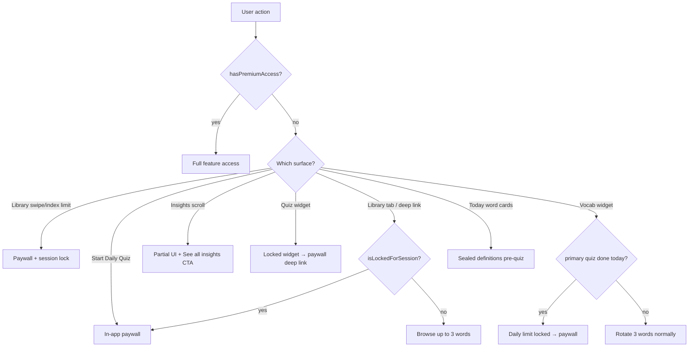

# GlanceSAT — Freemium, Subscription, and Lockouts

**Document purpose:** Everything you need to know about how the app treats **unsubscribed** users — how it knows who is subscribed, where limits apply, when lockouts fire, and how widgets stay in sync.  
**Audience:** Product, support, engineering.  
**Source of truth:** `EntitlementManager.swift`, `FreemiumLimits.swift`, `LibraryFreemiumSession.swift`, `DailyWordBatchService.swift`, `DailyHubView.swift`, `ExploreView.swift`, `ProgressView.swift`, `PaywallPresenter.swift`, `PaywallViews.swift`, `WidgetDailyState.swift`, `WidgetSubscriptionPrefs`, widget extension (`WidgetPrefsReader`, `GlanceSATQuizWidget`, `GlanceSATVocabularyWidget`).  
**Related:** [GlanceSAT_Three_Day_Full_Access_Pass.md](./GlanceSAT_Three_Day_Full_Access_Pass.md), [GlanceSAT_Todays_10_Daily_Words.md](./GlanceSAT_Todays_10_Daily_Words.md), [GlanceSAT_Onboarding_Current.md](./GlanceSAT_Onboarding_Current.md), [GlanceSAT_Home_Screen_Widgets_Guide.md](./GlanceSAT_Home_Screen_Widgets_Guide.md).

---

## 1. Executive summary

GlanceSAT is freemium. A user is treated as **fully subscribed** whenever:

```text
hasPremiumAccess = revenueCatPremiumActive || hasActiveThreeDayPass
```

| User type | How the app knows | Daily words | Daily quiz | Library | Insights | Quiz widget | Vocab widget |
|-----------|-------------------|-------------|------------|---------|----------|-------------|--------------|
| **Freemium** (no sub, no pass) | `hasPremiumAccess == false` | **3** | **Paywall** on Start/Resume CTA | **3 swipes** then paywall + session lock | **Partial** + paywall CTA | **Always locked** | **Open** until primary quiz done* |
| **3-day pass** (onboarding only) | `now < activeThreeDayPassExpiration` | **10** | Full access | Full | Full | Full | Full |
| **RevenueCat premium** | `premium_access` entitlement active | **10** | Full access | Full | Full | Full | Full |

\* Freemium users normally **cannot** complete the primary daily quiz (quiz CTA is paywalled). The vocab widget lock (`freemiumDailyLimitReached`) only becomes true after a primary quiz completion — relevant for users who **had** premium/pass, completed the quiz, then lapsed.

**The single gate used almost everywhere:** `EntitlementManager.shared.hasPremiumAccess` (injected as `@EnvironmentObject` in SwiftUI).

---

## 2. How the app knows if someone is subscribed

### 2.1 `EntitlementManager` — source of truth

File: `GlanceSAT/EntitlementManager.swift`

| Input | Storage | Active when |
|-------|---------|-------------|
| **RevenueCat entitlement** `premium_access` | RevenueCat `CustomerInfo` stream + one-shot fetch on `start()` | `customerInfo.entitlements["premium_access"]?.isActive == true` |
| **3-day no-card pass** | `@AppStorage("activeThreeDayPassExpiration")` (standard `UserDefaults`) | `Date() < expiration` → `hasActiveThreeDayPass` |

Published property:

```swift
@Published private(set) var hasPremiumAccess = false
```

Release build:

```text
hasPremiumAccess = revenueCatPremiumActive || hasActiveThreeDayPass
```

### 2.2 RevenueCat setup

- Configured in `EntitlementManager.configureIfNeeded()` from `RevenueCatAPIKey` in `Info.plist`.
- If the key is missing or `REPLACE_ME`, RevenueCat is **not** configured; subscription state falls back to the **local 3-day pass only**.
- `EntitlementManager.start()` is called from `AppBootstrap.performCriticalMainActorServices()` on every cold launch (before today's word batch refresh).

### 2.3 When `hasPremiumAccess` is recomputed

`publishAccess()` runs on:

| Trigger | Location |
|---------|----------|
| App launch | `EntitlementManager.start()` |
| RevenueCat `customerInfoStream` update | `apply(customerInfo:)` |
| Initial `customerInfo()` fetch | `start()` Task |
| 3-day pass activation / `reapplyAccess()` | `activateThreeDayPass`, `reapplyAccess` |
| Successful purchase or restore | `purchase`, `restorePurchases` |
| DEBUG override change | `DebugSubscriptionControls` → `reapplyAccess()` |

**Staleness note:** Foregrounding alone does **not** re-check pass expiration. If the app stays open continuously past 72 hours without a RevenueCat event, `hasPremiumAccess` may remain `true` until the next `publishAccess()` trigger. Same applies to widget App Group prefs until `syncWidgetSubscriptionState()` runs again.

### 2.4 DEBUG overrides

File: `DebugSubscriptionControls.swift` (DEBUG builds only)

| Override value | Effect |
|----------------|--------|
| `0` (force free) | `hasPremiumAccess = false`; also clears pass expiration when simulating free |
| `1` (force premium) | `hasPremiumAccess = true` regardless of RC/pass |
| `-1` (live) | Normal OR logic |

Accessible from in-app DEBUG settings menu in `GlanceSATApp.swift`.

---

## 3. Freemium limits (constants)

File: `FreemiumLimits.swift`

| Constant | Value | Meaning |
|----------|-------|---------|
| `freeDailyWordCount` | **3** | Max words on Today tab and in daily batch for freemium |
| `freeLibrarySwipesBeforePaywall` | **3** | Third user swipe in Library triggers paywall |
| `freeLibraryMaxWordIndex` | **3** | Navigating to word index ≥ 3 triggers paywall (indices `0`, `1`, `2` allowed) |
| `effectiveDailyWordCount` | 3 or 10 | `hasPremiumAccess ? 10 : 3` (`DailyWordBatchService.maxDailyWords` = 10) |

Daily batch selection uses the same SRS/mixed logic for all users; freemium gets `Array(words.prefix(effectiveDailyWordCount))` via `DailyWordBatchService.applySubscriptionCap`.

`DailyHubView` observes `hasPremiumAccess` and calls `syncDailyWords()` when it changes — so upgrading mid-day can backfill words; expiring mid-day can drop words 4–10 on next refresh.

---

## 4. What freemium users **can** do

| Area | Freemium experience |
|------|---------------------|
| **Today tab** | See **3** daily word cards with **word only** (definitions sealed — see §5.1) |
| **Streak bar** | Visible; streak logic runs from quiz sessions (freemium users typically have no new sessions without quiz) |
| **Library tab** | Browse **first 3 words** (by swipe count or index) per app session |
| **Insights tab** | Streak header, SAT countdown, Overview **row 1 only** (2 metrics); rest hidden behind paywall panel |
| **Vocabulary widget** | Rotates through today's words **until** primary quiz is marked complete for today |
| **Countdown widget** | No subscription gate |
| **Widget Studio / Settings** | No subscription gate |
| **Onboarding** | Can finish as freemium via paywall X → **Continue to widget setup** |

---

## 5. Lockouts — where, when, and what happens

### 5.1 Today — sealed word definitions (soft lock)

**Where:** `DailyHubView` → `DailyHubWordCapsule`  
**When:** Pre-quiz (`isPostQuiz: false`, `isRevealed: false`)  
**What:** Cards show the word title only. Body shows lock icon + *"Definitions unlock after first quiz attempt"* with blurred preview rows.

**Not a paywall** — this is a product rule for all users pre-quiz. Freemium users never reach post-quiz reveal via the normal path because the quiz itself is paywalled (§5.2).

Post-quiz cards (`isRevealed: true`) show full definitions — only reachable after completing a primary quiz (requires premium/pass at CTA tap time).

### 5.2 Today — Start / Resume Daily Quiz (hard paywall)

**Where:** `DailyHubView.dailyQuizCTA`  
**When:** User taps **Start Daily Quiz** or **Resume Daily Quiz**  
**Check:** `entitlementManager.hasPremiumAccess`  
**Action if false:** `paywallPresenter.presentPaywall()` — full-screen paywall (`AppPaywallChrome`), **no** 3-day downsell sheet

```swift
if entitlementManager.hasPremiumAccess {
    startDailyQuiz()
} else {
    paywallPresenter.presentPaywall()
}
```

**Important:** `startDailyQuiz()` itself does **not** re-check premium. The only entry point for new sessions is the CTA. Post-quiz buttons (**Resume quiz**, **Take another quiz**) call `startDailyQuiz()` / `startAnotherDailyQuiz()` **without** a premium check — edge case for users who completed a quiz while subscribed then lapsed.

### 5.3 Library — swipe and index limits (paywall + session lock)

**Where:** `ExploreView.applyLibraryScrollPositionChange` + `LibraryFreemiumSession`  
**When:** Freemium user swipes or navigates to a new word  

Two independent tripwires (either fires the lock):

1. **Index gate:** `nextIndex >= FreemiumLimits.freeLibraryMaxWordIndex` (i.e. 4th word)
2. **Swipe gate:** `swipeCount >= FreemiumLimits.freeLibrarySwipesBeforePaywall` (3rd swipe)

**Action:**

1. Revert pager to previous word (`freemiumRevert` programmatic scroll)
2. `paywallPresenter.presentPaywall(onDismissed: { post .libraryFreemiumPaywallDismissed })`
3. Set `isLockedForSession = true` — **Library stays blocked until app process restarts**

**Session lock side effects** (`GlanceSATApp.swift`):

| Action | Behavior if `isLockedForSession && !hasPremiumAccess` |
|--------|------------------------------------------------------|
| Tap **Library** tab | Paywall instead of tab switch |
| Widget deep link to a word | Paywall instead of opening Library |
| Dismiss paywall from Library gate | App switches to **Today** tab (via notification handler) |

`resetBrowseSession()` clears the lock (DEBUG button, or simulating free user in DEBUG).

### 5.4 Insights — partial UI + paywall CTA (soft lock)

**Where:** `GlanceSATProgressScreen` (`ProgressView.swift`)  
**When:** `!entitlementManager.hasPremiumAccess` → `showsInsightsFreemiumLockout`  
**What:**

- Shows: streak header, SAT countdown, Overview section **first metric row only** (Glanced + Quiz Accuracy)
- Hides: Overview row 2, Strengths by category, Trajectory charts
- Overlay: *"See your strengths, weaknesses and latest trends"* + **See all insights** button → `presentPaywall()`

Premium users get full scrollable `premiumInsightsScroll`.

### 5.5 In-app paywall presentation

**Coordinator:** `PaywallPresenter` — `showsFullPaywall` drives a root-level `.fullScreenCover` via `AppPaywallChrome` modifier on `AppRootView`.

**Entry points (production):**

| Source | File |
|--------|------|
| Today quiz CTA | `DailyHubView` |
| Library swipe/index limit | `ExploreView` |
| Library tab while session-locked | `GlanceSATApp.selectRootTab` |
| Widget word deep link while session-locked | `GlanceSATApp.applyWidgetDeepLinkRouting` |
| Insights "See all insights" | `ProgressView` |
| Widget `glancesat://paywall` deep link | `GlanceSATApp.onOpenURL` / `onAppear` |

**Close behavior:** X calls `handlePaywallCloseAttempt()` → dismiss only. No downsell sheet in-app.

**Purchase success:** `entitlementManager.purchase` / `restorePurchases` → if entitlement active, `paywallPresenter.dismissPaywall()`.

### 5.6 Quiz widget — always locked for freemium

**Where:** `GlanceSATQuizWidget` timeline + `GlanceSATQuizWidgetRootView`  
**When:** `!WidgetPrefsReader.hasPremiumAccess()`  
**What:**

- Timeline returns a single locked entry (no quiz rotation)
- UI: lock icon + *"Unlock the quiz widget"*
- Tap → `glancesat://paywall` deep link
- `AnswerWidgetQuizIntent` no-ops if `!hasPremiumAccess()`

There is **no** freemium 3-word quiz widget mode. Quiz widget is premium-only.

### 5.7 Vocabulary widget — lock after primary quiz (conditional)

**Where:** `GlanceSATVocabularyWidget.shouldShowFreemiumLock()`  
**When:**

```text
!hasPremiumAccess && freemiumDailyLimitReached
```

Where `freemiumDailyLimitReached` is written by the host when:

```text
!hasPremiumAccess && primaryQuizCompletedToday
```

**What:**

- Timeline collapses to locked entry
- UI: *"Daily limit reached."* + lock icon (home and lock-screen families)
- Tap → `glancesat://paywall`

**Typical freemium user:** Never completes primary quiz → `freemiumDailyLimitReached` stays `false` → vocab widget keeps rotating 3 words.

**Lapsed subscriber:** Completed quiz while premium → flag set on completion → vocab widget locks even after subscription expires (until next calendar day clears quiz flag or user resubscribes).

### 5.8 Countdown widget

No subscription check. Available to all users.

---

## 6. Widget subscription sync pipeline

Widgets cannot call RevenueCat. They read **App Group** `UserDefaults` written by the host.

### 6.1 Keys

| App Group key | Writer | Reader |
|---------------|--------|--------|
| `widget.subscription.hasPremium` | `WidgetSubscriptionPrefs.write` | `WidgetPrefsReader.hasPremiumAccess()` |
| `widget.subscription.freemiumLimitReached` | same | `WidgetPrefsReader.isFreemiumDailyLimitReached()` |
| `widget.primaryQuizCompletedDayKey` | `WidgetDailyState.markPrimaryQuizCompleted` | `WidgetPrefsReader.isPrimaryQuizCompleted` |

### 6.2 When host syncs

`EntitlementManager.syncWidgetSubscriptionState(quizCompletedToday:)` writes both subscription keys and is called from:

- `EntitlementManager.start()`
- RevenueCat customer info updates
- Purchase / restore / `reapplyAccess()` / pass activation
- `DailyWordBatchService.refresh` (end of batch rebuild)
- Primary quiz completion in `DailyHubView` (with `quizCompletedToday: true`)

After writes, relevant code paths call `WidgetCenter.shared.reloadAllTimelines()`.

### 6.3 Primary quiz completion flag

On primary quiz finish (`DailyHubView`):

```swift
WidgetDailyState.markPrimaryQuizCompleted(streakDays: quizStreakDays)
entitlementManager.syncWidgetSubscriptionState(quizCompletedToday: true)
```

This is what flips `freemiumDailyLimitReached` for unsubscribed users who have completed today's quiz.

---

## 7. Deep links from widgets

| URL | Handler | Freemium behavior |
|-----|---------|-------------------|
| `glancesat://paywall` | `WidgetDeepLinkRouter` → `presentPaywall()` | Opens in-app paywall |
| `glancesat://today` | Navigate to Today tab | Allowed |
| `glancesat://settings` | Library tab + open settings notification | Allowed |
| `glancesat://library/word/{uuid}` | Queue word, open Library | Blocked if library session locked → paywall |

---

## 8. Onboarding paths into freemium

See [GlanceSAT_Three_Day_Full_Access_Pass.md](./GlanceSAT_Three_Day_Full_Access_Pass.md) for full detail.

**Freemium entry:** Onboarding paywall (page 7) → tap **X** → downsell sheet → **Continue to widget setup** (no pass).

**Premium entry (no freemium):**

- Primary CTA **Start my 7-day free trial** → RevenueCat purchase
- Downsell **Start 3-Day Free Pass** → 72h local pass (treated as premium)

After onboarding, `AppBootstrap` runs `EntitlementManager.start()` + `DailyWordBatchService.refresh` — freemium users get a 3-word batch immediately.

---

## 9. Post-trial win-back (lapsed subscribers)

`EntitlementManager.evaluatePostTrialWinBack` sets `showsPostTrialWinBack = true` when:

- User does **not** have premium
- `premium_access` entitlement is **inactive**
- Expiration was within the **last 7 days**
- `hasShownPostTrialWinBack` is false (one-shot)

**Not triggered by:** 3-day pass expiry.

**UI status:** `showsPostTrialWinBack` is published but **not wired to any production UI** today. DEBUG can clear it via "Reset paywall promo flags".

---

## 10. Edge cases

### 10.1 Subscribed → freemium mid-day

- Word cap drops from 10 → 3 on next `DailyWordBatchService.refresh` / `syncDailyWords`
- Quiz widget locks on next timeline reload
- If primary quiz was already completed today: vocab widget locks (`freemiumDailyLimitReached = true`)
- Library session lock persists if already triggered; otherwise swipe limits apply again

### 10.2 Freemium → premium mid-day

- `onChange(hasPremiumAccess)` in `DailyHubView` triggers `syncDailyWords()` — batch may backfill to 10 words
- `syncWidgetSubscriptionState()` clears freemium widget flags
- Library session lock is **not** auto-cleared on subscribe — user may need app restart or DEBUG reset (lock only matters for freemium)

### 10.3 Resume / supplemental quiz after lapse

- **Resume Daily Quiz** CTA is behind the same premium gate as Start
- **Take another quiz** / **Resume quiz** (post-quiz hero) are **not** premium-gated
- A user who completed primary quiz while premium could still run supplemental rounds after lapsing

### 10.4 RevenueCat unavailable

- `hasPremiumAccess` = `hasActiveThreeDayPass` only
- Purchases throw `SubscriptionStoreError.notConfigured`
- Paywall still shows; purchase button may fail

### 10.5 In-app 3-day downsell

`canOfferPaywallDownsell` and `activateThreeDayPass(markDownsellClaimed:)` exist but are **not** connected to in-app paywall UI. Only onboarding downsell sheet grants the pass.

---

## 11. Decision flow (quick reference)



---

## 12. File index

| Concern | Primary files |
|---------|---------------|
| Subscription truth | `EntitlementManager.swift` |
| Freemium constants | `FreemiumLimits.swift` |
| Daily word cap | `DailyWordBatchService.swift` |
| Quiz CTA gate | `DailyHubView.swift` |
| Library gate | `LibraryFreemiumSession.swift`, `ExploreView.swift` |
| Insights gate | `ProgressView.swift` |
| Paywall UI | `PaywallPresenter.swift`, `PaywallViews.swift` |
| Tab / deep link gates | `GlanceSATApp.swift`, `WidgetDeepLinkRouter.swift` |
| Widget prefs write | `EntitlementManager.syncWidgetSubscriptionState`, `WidgetDailyState` |
| Widget prefs read | `WidgetPrefsReader.swift` |
| Quiz widget lock | `GlanceSATQuizWidget.swift`, `GlanceSATQuizWidgetViews.swift` |
| Vocab widget lock | `GlanceSATVocabularyWidget.swift`, `GlanceSATWidgetViews.swift` |
| Bootstrap / launch | `AppBootstrap.swift` |
| DEBUG simulation | `DebugSubscriptionControls.swift` |

---

## 13. Support cheat sheet

| User says… | Likely state | What to check |
|------------|--------------|---------------|
| "I only see 3 words" | Freemium or expired pass | `hasPremiumAccess`, `activeThreeDayPassExpiration` |
| "Quiz button opens payment screen" | Expected freemium | No active `premium_access` or pass |
| "Library locked after I swiped" | Session lock | Kill and reopen app; or subscribe |
| "Widget says daily limit reached" | Quiz done today + not subscribed | `widget.subscription.freemiumLimitReached`, `widget.primaryQuizCompletedDayKey` |
| "Quiz widget shows lock" | Freemium | Quiz widget is premium-only; vocab may still work |
| "I had premium yesterday" | Lapsed RC trial/sub | Check RevenueCat; post-trial win-back flag may be set internally but no auto UI |

---

*Last updated from codebase audit: June 2026.*
