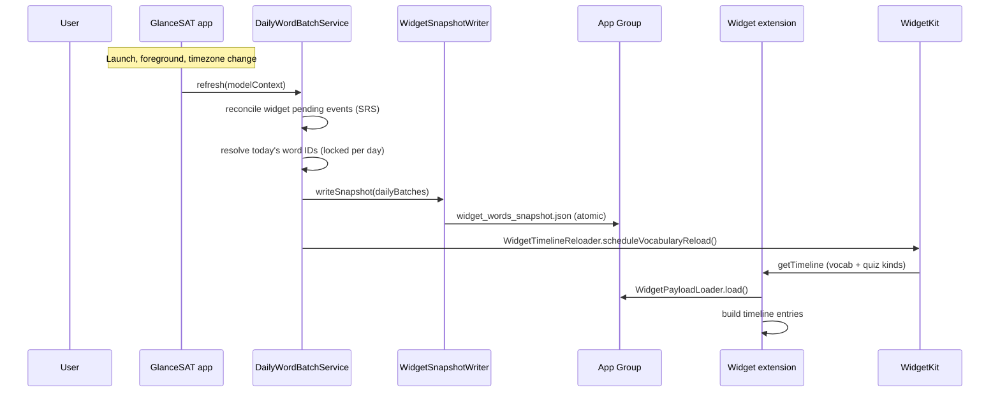
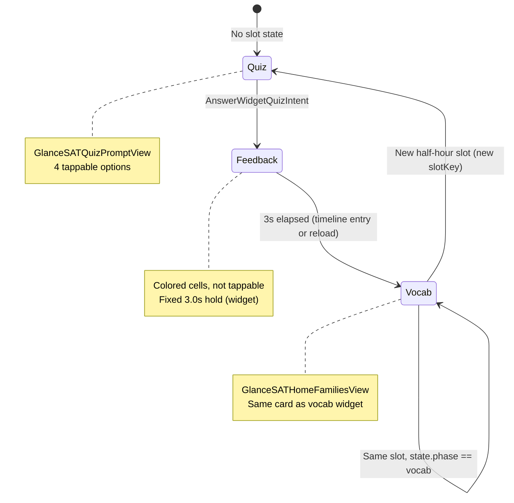
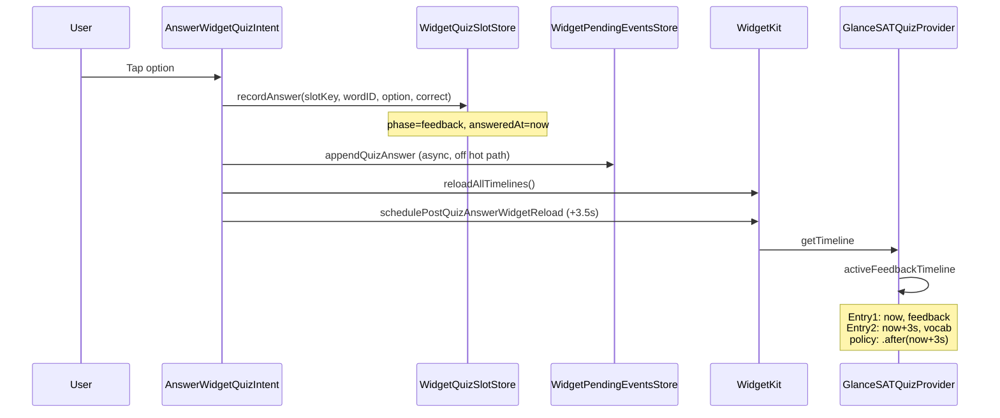
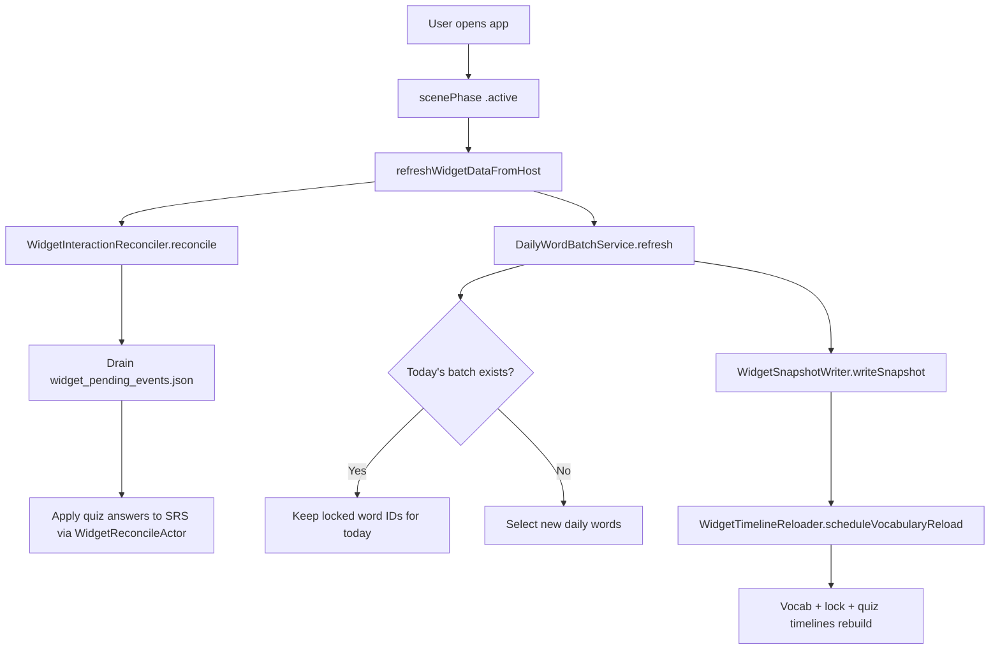

# GlanceSAT — Home Screen Vocabulary & Quiz Widgets (Complete Guide)

| Field | Value |
|-------|--------|
| **Audience** | Engineering, product, support |
| **Widgets covered** | **Glance SAT Vocabulary** (home + lock screen), **Glance SAT Quiz** (home only) |
| **Extension target** | `GlanceSATWidgets` |
| **App Group** | `group.com.glance.GlanceSAT` |
| **Related** | [GlanceSAT_Quiz_Widget.md](GlanceSAT_Quiz_Widget.md), [GlanceSAT_Widget_Data_and_Timeline.md](GlanceSAT_Widget_Data_and_Timeline.md), [GlanceSAT_Widget_Daily_Rotation.md](GlanceSAT_Widget_Daily_Rotation.md), [GlanceSAT_Todays_10_Daily_Words.md](GlanceSAT_Todays_10_Daily_Words.md) |
| **Last updated** | June 2026 |

---

## Executive summary

Both home-screen widgets are **read-only consumers** of a pre-built JSON snapshot written by the host app. They **never open SwiftData** at runtime. Word selection is **deterministic**: local clock time maps to a half-hour **slot index**, which maps to an array index in today’s daily batch.

| | **Vocabulary widget** | **Quiz widget** |
|--|----------------------|-----------------|
| **Picker name** | Glance SAT Vocabulary | Glance SAT Quiz |
| **Kind ID** | `com.mikihill.GlanceSAT.vocabulary` (+ lock-screen variant) | `com.mikihill.GlanceSAT.quiz` |
| **Families** | Small, Medium, Large + Lock inline/rect/circular | Medium, Large only |
| **Access** | Freemium (3 words) or premium (10 words); locks after primary in-app quiz if not subscribed | **Premium / trial only** — otherwise fully locked |
| **Word index** | `slot % N` | `(slot + 1) % N` |
| **UI modes** | Word card only | Quiz → 3s feedback → word card |
| **In-widget interaction** | Hook / example reveal buttons | Answer sentence-completion quiz |

**They are not two independent data sources.** They share the same snapshot, the same dismissed-word filter, the same theme/typography prefs, and the same hook/example reveal state. The quiz widget adds its own per-slot phase store and pending SRS events.

---

## 1. Architecture: host app → extension



### 1.1 What the host writes

| Artifact | Path / key | Written by |
|----------|------------|------------|
| Word snapshot | `{App Group}/widget_words_snapshot.json` | `WidgetSnapshotWriter.writeSnapshot` |
| Subscription flags | `widget.subscription.hasPremium`, `widget.subscription.freemiumLimitReached` | `EntitlementManager.syncWidgetSubscriptionState` |
| Primary quiz done | `widget.primaryQuizCompletedDayKey`, `widget.streakDays` | `WidgetDailyState.markPrimaryQuizCompleted` |
| Style prefs | `widget.prefs.style`, `.theme`, `.typography`, lock alignment | Host settings UI |
| Pending SRS events | `{App Group}/widget_pending_events.json` | Extension App Intents (drained by host) |

### 1.2 Snapshot schema

`WidgetSnapshotPayload` contains:

- `updatedAt` — last write timestamp
- `dailyBatches` — map of `"yyyy-MM-dd"` → `[WidgetWordSnapshot]` (up to **4 days** precomputed)

Each `WidgetWordSnapshot` includes headword, definition, example, etymology/hook, semantic charge, and up to **3 sentence-quiz slots** (widget-only quiz sentences built by `WidgetSentenceQuizBuilder` in the host).

The extension reads via `WidgetPayloadLoader.load()`, which caches in memory keyed on file modification date.

### 1.3 What widgets read at `getTimeline`

1. `WidgetPayloadLoader.load()` → snapshot
2. `WidgetCalendar.dayKey(for: now)` → today’s key
3. `WidgetTimelineBuilder.wordsForDay(todayKey, in: payload)` → today’s array (or **stale** if missing)
4. `WidgetInteractionStore.visibleWords(from:)` → filter dismissed IDs
5. `WidgetPrefsReader` → theme, subscription, streak, etc.
6. (Quiz only) `WidgetQuizSlotStore` → per-slot phase for answered slots

---

## 2. Shared data & communication between widgets

The two widgets **do not message each other directly**. They coordinate through **shared App Group storage** and **coordinated WidgetKit reloads**.

### 2.1 Shared storage

| Data | Used by vocab | Used by quiz | Notes |
|------|:-------------:|:------------:|-------|
| `widget_words_snapshot.json` | ✓ | ✓ | Same daily word arrays |
| `widget.interactions.dismissedWordIDs` | ✓ | ✓ | `visibleWords` filter |
| `widget.interactions.revealedExampleWordIDs` | ✓ | ✓ | Quiz `.vocab` phase uses same `GlanceSATHomeFamiliesView` |
| `widget.interactions.revealedDetailWordIDs` (hook) | ✓ | ✓ | Same |
| `widget.prefs.theme` / `.typography` / `.style` | ✓ | ✓ | Visual consistency |
| `widget.subscription.hasPremium` | ✓ | ✓ | Different lock behavior |
| `widget.subscription.freemiumLimitReached` | ✓ | — | Vocab daily-limit tile only |
| `widget.quiz.slot.{slotKey}` | — | ✓ | Quiz phase state only |
| `widget_pending_events.json` | — | ✓ (writes) | Quiz answers queued; host drains on refresh |

### 2.2 Coordinated reloads

| Trigger | Vocab reloaded? | Quiz reloaded? |
|---------|:---------------:|:--------------:|
| `DailyWordBatchService.refresh` → `WidgetTimelineReloader.scheduleVocabularyReload` | ✓ (+ lock screen) | ✓ |
| `AnswerWidgetQuizIntent` → `reloadAllTimelines()` | ✓ | ✓ |
| `ToggleWidgetExampleIntent` / `ToggleWidgetDetailIntent` | ✓ (+ lock screen) | — |
| App `scenePhase == .background` → `reloadAllTimelines()` | ✓ | ✓ |
| `WidgetDailyState.markPrimaryQuizCompleted` | ✓ | ✓ |
| Timeline policy `.atEnd` (system) | ✓ | ✓ |
| Quiz +3.5s backup (`schedulePostQuizAnswerWidgetReload`) | — | ✓ only |

**Practical effect:** Answering the quiz widget reloads **both** widget kinds immediately (feedback UI). Hook/example toggles on the vocab card reload **vocabulary kinds only** — but if the quiz widget is in `.vocab` phase showing the same card, it will **not** pick up reveal-state changes until its own timeline reloads.

### 2.3 Shared UI component

When the quiz widget is in `.vocab` phase, it renders `GlanceSATHomeFamiliesView` — the **same** word-card view as the vocabulary widget (definition, hook/example tray, deep link). The word shown is still the **quiz index** word for that slot, not the vocab index word.

### 2.4 Deliberate differences

| Concern | Vocabulary | Quiz |
|---------|------------|------|
| Word at noon (slot 24, N=10) | `words[4]` | `words[5]` |
| Sentence variant | N/A | `slotIndex % 3` picks 1 of 3 `sentenceQuizSlots` |
| Phase state | None | `WidgetQuizSlotStore` per `slotKey` |
| Freemium lock tile | Yes, after in-app primary quiz | No — binary premium lock |

---

## 3. The 30-minute rotation grid

Both widgets schedule timeline entries on the same **48-slot-per-day** grid.

```text
slotIndex = min(floor(minutesSinceMidnight / 30), 47)
slotKey   = "{yyyy-MM-dd}_{slotIndex}"    // quiz state only
```

| Local time | Slot index |
|------------|------------|
| 12:00 AM | 0 |
| 12:30 AM | 1 |
| Noon | 24 |
| 11:30 PM | 47 |

### 3.1 Word index formulas

```text
vocabIndex = slotIndex % wordCount
quizIndex  = (slotIndex + 1) % wordCount
```

- **Premium:** `wordCount` = up to **10** (snapshot array length)
- **Freemium:** `wordCount` = **3**

### 3.2 Timeline entry dates

`WidgetTimelineBuilder.remainingHalfHourSlotDates(from: now)`:

1. Walks every `:00` / `:30` from the current half-hour **floor** through **23:30** today
2. Includes slots at or after `now`
3. Inserts `now` at the front if needed so the widget can update immediately after reload

WidgetKit displays the entry with the **latest `date` ≤ current time**.

**Horizon:** Timelines are built **only through end of the current local day**. Tomorrow’s words exist in the snapshot but are not scheduled until the host refreshes after the calendar day changes.

### 3.3 Quiz sentence rotation

Within a slot, the quiz widget can show one of up to **3** pre-built sentence variants:

```text
sentenceSlotIndex = slotIndex % 3
word' = baseWord.withSentenceQuizSlot(sentenceSlotIndex)
```

The headword stays the same; prompt and answer options change.

---

## 4. Vocabulary widget — full lifecycle

**Files:** `GlanceSATVocabularyWidget.swift`, `WidgetTimelineBuilder.swift`, `GlanceSATWidgetViews.swift`

### 4.1 Widget kinds

| Kind | Families |
|------|----------|
| `com.mikihill.GlanceSAT.vocabulary` | systemSmall, systemMedium, systemLarge |
| `com.mikihill.GlanceSAT.vocabulary.lockScreen` | accessoryInline, accessoryRectangular, accessoryCircular |

Both use the same `GlanceSATProvider` timeline provider.

### 4.2 `getTimeline` decision tree

```
getTimeline
├── shouldShowFreemiumLock()?  → single locked entry, policy .atEnd
├── no batch for todayKey?     → single stale entry, policy .atEnd
└── normal
    ├── visibleWords from snapshot (fallback if all dismissed)
    ├── WidgetTimelineBuilder.buildVocabularyEntries(now, words)
    └── Timeline(entries, policy: .atEnd)
```

### 4.3 Normal rotation entries

For each slot date from `remainingHalfHourSlotDates(now)`:

```swift
GlanceSATEntry(
    date: slotDate,
    word: word(at: slotDate, in: words),  // vocabIndex
    streakDays: WidgetPrefsReader.streakDays()
)
```

Entries are sorted and deduped (within 0.5s, same word ID).

### 4.4 UI states

| Condition | View | Deep link |
|-----------|------|-----------|
| `isStaleSnapshot` | “Updating today's words…” | Library (if word present) |
| `isDailyLimitLocked` | “Daily limit reached” | Paywall |
| `isResting` | Rest / streak view (legacy path; not set in current rotation builder) | Library |
| Normal | `GlanceSATHomeFamiliesView` or lock-screen variants | `glancesat://library/word/{uuid}` |

### 4.5 In-widget interactions (vocab only)

| Intent | Action | Reload |
|--------|--------|--------|
| `ToggleWidgetExampleIntent` | Toggle example sentence reveal for `wordID` | Vocabulary kinds only |
| `ToggleWidgetDetailIntent` | Toggle hook/origin reveal (exclusive with example) | Vocabulary kinds only |

Reveal state is stored in App Group UserDefaults. The view reads it live via `WidgetInteractionStore.isExampleRevealed` / `isHookRevealed` — but a reload is still scheduled so WidgetKit refreshes the timeline.

**Dismissed words:** `widget.interactions.dismissedWordIDs` removes words from the rotation array. If all are dismissed, the filter falls back to the full list.

### 4.6 Freemium lock

After the user completes the **primary in-app daily quiz** without premium:

1. `WidgetDailyState.markPrimaryQuizCompleted` sets `widget.primaryQuizCompletedDayKey`
2. `EntitlementManager.syncWidgetSubscriptionState` sets `freemiumDailyLimitReached = true`
3. Vocabulary widget shows the lock tile for the rest of the day

Premium users and active trial/pass never see this lock.

---

## 5. Quiz widget — full lifecycle

**Files:** `GlanceSATQuizWidget.swift`, `GlanceSATQuizWidgetViews.swift`, `WidgetQuizSlotStore.swift`, `WidgetWordIntents.swift`

### 5.1 Access model

- **Not premium:** `lockedTimeline` — single entry, “Unlock the quiz widget”, paywall deep link
- **Premium / trial:** Full quiz + rotation behavior

Unlike vocabulary, there is no “3 free words then lock” — the quiz widget is entirely gated on subscription.

### 5.2 `getTimeline` decision tree

```
getTimeline
├── !hasPremiumAccess?        → lockedTimeline, policy .atEnd
├── no batch for todayKey?    → single stale entry
├── empty visible words?      → placeholder entry
├── finalizeExpiredFeedback(now)
├── anyActiveFeedback(now)?   → short 2-entry feedback timeline (see §5.5)
└── buildQuizEntries(now)     → half-hour rotation, policy .atEnd
```

### 5.3 Word selection rule (critical)

**The word shown is always derived from the live snapshot and slot index — never from stored slot `wordID`.**

```text
quizIndex = (slotIndex % wordCount + 1) % wordCount
word      = words[quizIndex] with sentence slot applied
```

Stored `WidgetQuizSlotState` influences **phase only** (`.quiz` / `.feedback` / `.vocab`), not which word is selected.

All three phases use **quizIndex**:

| Code path | Selection method |
|-----------|------------------|
| `appendRotationEntries` | `quizWord(forSlotKey:)` → `WidgetSlotClock.word(atQuizSlot:)` |
| `activeFeedbackTimeline` | `quizWord(forSlotKey: feedback.slotKey)` |
| `entry(for:)` snapshot | `WidgetTimelineBuilder.quizWord(at:)` or `quizWord(forSlotKey:)` |

`vocabIndex` (`slot % N`) is **never** used in quiz widget word selection.

### 5.4 Display phases



| Phase | UI | How entered |
|-------|-----|-------------|
| `.quiz` | Sentence prompt + `AnswerWidgetQuizIntent` buttons | Default; no `WidgetQuizSlotState` for this slot |
| `.feedback` | Styled options, not tappable | `WidgetQuizSlotStore.recordAnswer` |
| `.vocab` | Word card with hook/example | Timeline entry after 3s, or store `phase == .vocab` |

**Words without quiz data** (`!hasSentenceQuiz`): `makeEntry` forces `.vocab` — user only sees the word card.

**Rendering uses `entry.displayPhase` from the timeline**, not live `resolvedPhase`. WidgetKit entry date transitions drive the UI.

### 5.5 Answering a quiz (step by step)



**Immediate reload (`reloadAllTimelines`):**

- Quiz: 2-entry timeline — feedback at `now`, vocab at `now + 3s`
- Vocab: full rotation rebuild (side effect of `reloadAllTimelines`)

**At +3s:** WidgetKit policy `.after(transitionDate)` triggers another `getTimeline` → `buildQuizEntries` (full day rotation).

**At +3.5s:** Backup quiz-only reload (`WidgetIntentReload.schedulePostQuizAnswerWidgetReload`) in case WidgetKit did not advance the vocab entry.

**Host SRS:** `WidgetPendingEventsStore.appendQuizAnswer` queues a `.quizAnswer` event. On next `DailyWordBatchService.refresh`, `WidgetInteractionReconciler.reconcile` drains the file and applies SRS via `WidgetReconcileActor`. **The widget does not wait for this.**

### 5.6 Per-slot state (`WidgetQuizSlotStore`)

```text
Key:   widget.quiz.slot.{slotKey}
Value: JSON { wordID, phase, selectedOption, wasCorrect, answeredAt }
```

| `phase` | Meaning |
|---------|---------|
| `.feedback` | Show feedback until `answeredAt + 3.0s` |
| `.vocab` | Show word card for rest of this half-hour slot |

Slot keys include the calendar day (`2026-06-03_14`), so state does not bleed across midnight.

`finalizeExpiredFeedback(now)` promotes expired `.feedback` → `.vocab` before building rotation entries.

`resolvedPhase(slotKey:wordID:now:)` (timeline building only):

1. Exact `wordID` match → return stored phase (treat expired feedback as vocab)
2. Else if slot has any `.feedback` or `.vocab` state → return `.vocab` (answered slot stays vocab even if snapshot word identity shifts)
3. Else → `.quiz`

### 5.7 Answered-slot timeline anchoring

When the current slot is in `.vocab` phase, `rotationSlotDates` collapses the schedule to:

- **One entry** at the slot boundary (`:00` or `:30`) for the answered slot
- Future slot entries only (no mid-slot `now` duplicate)

`dedupeSortedEntries` keeps the **earliest** entry per `slotKey` to prevent WidgetKit from advancing to a later duplicate with a different effective date.

### 5.8 Deep links

Quiz widget root always sets:

```text
.widgetURL(glancesat://library/word/{entry.word.id})
```

Tapping anywhere on the widget (including during quiz/feedback) opens Library to that word.

---

## 6. When widgets update

### 6.1 Automatic (no user action)

| Event | What happens |
|-------|--------------|
| Clock passes next timeline entry `date` | WidgetKit advances to next entry (word change at :00/:30) |
| Timeline policy `.atEnd` fires | System calls `getTimeline` again (rebuild from current `now`) |
| Quiz feedback `policy: .after(+3s)` | Short rebuild at transition |
| Quiz +3.5s backup reload | Quiz kind only |

### 6.2 Host-driven reloads

| Event | Host action | Widget effect |
|-------|-------------|---------------|
| App launch bootstrap | `DailyWordBatchService.refresh` | New snapshot + debounced reload (~0.4s) |
| `scenePhase == .active` | `refreshWidgetDataFromHost` | Reconcile pending events, refresh batch, rewrite snapshot, reload |
| `scenePhase == .background` | `reloadAllTimelines()` | Immediate rebuild (no snapshot write) |
| Timezone change | `refreshWidgetDataFromHost` | New `dayKey`, new slot grid |
| Primary quiz completed in app | `WidgetDailyState` + subscription sync | Vocab may show lock tile |
| Subscription change | `EntitlementManager.reapplyAccess` | Reload all |
| Debug / Widget Studio refresh | `WidgetSnapshotWriter.refresh` | Reload |

### 6.3 User interaction reloads

| Action | Reload scope |
|--------|--------------|
| Answer quiz widget | `reloadAllTimelines()` + quiz +3.5s backup |
| Toggle hook/example on vocab card | Vocabulary + lock-screen kinds |
| (Legacy) dismiss word | Would affect `visibleWords` on next full rebuild |

---

## 7. What happens when the app is opened



**Important:** Opening the app does **not** change which word maps to a given time slot (today’s batch IDs are calendar-day locked). It **does**:

1. Apply any queued widget quiz answers to SRS
2. Ensure snapshot is fresh for today’s `dayKey`
3. Rebuild widget timelines from current `now`
4. Clear stale `primaryQuizCompletedDayKey` if the stored day ≠ today

If the user opens the app after midnight before refresh completes, widgets may briefly show **stale** UI until the host writes the new day’s batch.

---

## 8. What does *not* change widget words

| Action | Effect |
|--------|--------|
| Opening the app (same day, same time) | Same word index mapping |
| Revealing hook/example | Same word; UI toggle only |
| Answering quiz in widget | Same **quiz** word for that slot; phase changes |
| SRS updates in app | Does not change today’s batch composition |
| Completing primary in-app quiz | Vocab lock tile only; rotation math unchanged |
| Widget alone at midnight | Stale until host refresh |

---

## 9. Stale, empty, and error states

| State | Condition | Vocabulary UI | Quiz UI |
|-------|-----------|---------------|---------|
| **Stale snapshot** | No `dailyBatches[todayKey]` | “Updating today's words…” | Same stale view |
| **Empty visible words** | All dismissed (quiz) | Placeholder word | Placeholder entry |
| **Freemium lock** | Quiz done + not premium | Lock tile → paywall | N/A |
| **Quiz premium lock** | `!hasPremiumAccess` | N/A | “Unlock the quiz widget” |
| **Fallback load failure** | Missing App Group / corrupt JSON | Placeholder “Glance” | Placeholder |

---

## 10. Premium vs freemium summary

| Feature | Freemium | Premium |
|---------|----------|---------|
| Words in snapshot | 3 | 10 |
| Vocab widget rotation | `slot % 3` | `slot % 10` |
| Quiz widget | Locked entirely | Full access |
| After in-app primary quiz | Vocab widget locks | No lock |
| Hook/example on widget | Yes (when not locked) | Yes |

---

## 11. Implementation index

| Topic | File(s) |
|-------|---------|
| Vocabulary provider | `GlanceSATWidgets/GlanceSATVocabularyWidget.swift` |
| Quiz provider | `GlanceSATWidgets/GlanceSATQuizWidget.swift` |
| Rotation math | `GlanceSATWidgets/WidgetTimelineBuilder.swift`, `WidgetSlotClock.swift` |
| Vocabulary UI | `GlanceSATWidgets/GlanceSATWidgetViews.swift` |
| Quiz UI | `GlanceSATWidgets/GlanceSATQuizWidgetViews.swift` |
| Quiz slot state | `GlanceSATWidgets/WidgetQuizSlotStore.swift` |
| App Intents | `GlanceSATWidgets/WidgetWordIntents.swift` |
| Snapshot read (extension) | `GlanceSATWidgets/WidgetPayload.swift` |
| Snapshot write (host) | `GlanceSAT/WidgetSnapshotWriter.swift` |
| Batch + snapshot pipeline | `GlanceSAT/DailyWordBatchService.swift` |
| Pending event drain (host) | `GlanceSAT/WidgetInteractionReconciler.swift` |
| Reload debounce (host) | `GlanceSAT/WidgetTimelineReloader.swift` |
| Reload helpers (extension) | `GlanceSATWidgets/WidgetIntentReload.swift` |
| App foreground refresh | `GlanceSAT/GlanceSATApp.swift` |
| Subscription → widget prefs | `GlanceSAT/EntitlementManager.swift` |
| Primary quiz → widget flags | `GlanceSAT/WidgetDailyState.swift` |
| Widget constants | `GlanceSATWidgetConstants` in `GlanceSATVocabularyWidget.swift` |

---

## 12. FAQ

**Why do Glance and Glance Quiz show different words at the same time?**  
By design: quiz uses `(slot + 1) % N`.

**Why did the quiz word change ~1 minute after answering?**  
A mid-slot `now` timeline entry could duplicate the answered slot; WidgetKit advanced to the later entry. Fixed by anchoring answered slots to `:00`/`:30` only (`rotationSlotDates` + `dedupeSortedEntries`).

**Does answering the quiz widget change the vocabulary widget’s word?**  
No. They use different index offsets. `reloadAllTimelines` rebuilds both, but each still applies its own formula.

**If I reveal the example on the quiz widget’s vocab card, does the vocab widget update?**  
Reveal state is shared, but only vocabulary kinds are reloaded by that intent. The quiz widget updates on its next reload.

**When does the word change if I never open the app?**  
At each scheduled half-hour boundary (`:00` / `:30`) via pre-built timeline entries. Through midnight, widgets go stale until the app (or a background refresh path) writes tomorrow’s snapshot.

**Does the quiz widget celebrate finishing the in-app primary quiz?**  
No. Celebration and post-quiz UI are in-app. The quiz widget only cares about premium access and per-slot answer state.

---

## 13. Quick reference — reload policy

| Widget | Normal policy | Exception |
|--------|---------------|-----------|
| Vocabulary | `.atEnd` | — |
| Quiz (rotation) | `.atEnd` | — |
| Quiz (active feedback) | `.after(now + 3s)` | Then returns to `.atEnd` on next build |
