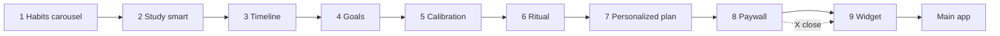

# Glance: SAT® Vocab Prep — Current Onboarding Flow

**Document purpose:** Accurate reference for the **live** first-run onboarding experience.  
**Source of truth:** `GlanceSAT/GlanceSAT/OnboardingView.swift`, `GlanceSATApp.swift` (May 2026).  
**Audience:** Product, design, copy, engineering, and growth reviewers.  
**Related:** [GlanceSAT_Onboarding_Conversion_Blueprint.md](./GlanceSAT_Onboarding_Conversion_Blueprint.md) (strategic proposal; not tied 1:1 to this build).

---

## 1. Executive summary

Glance onboarding is a **9-screen**, full-screen first-run flow shown when `hasCompletedOnboarding` is `false`. It introduces Lock Screen passive vocabulary exposure, collects personalization (test date, goals, vocabulary baseline, evening quiz time), presents a **paywall placeholder** (StoreKit not wired), and ends with **widget activation** before entering the main app.

**Product loop sold:**

> Passive exposure on the Lock Screen → one short daily recall quiz → spaced repetition adapts over time.

**No account creation.** All personalization is stored locally via `@AppStorage` / `UserDefaults`. Paywall **Start my 7-day free trial** advances to the widget screen only — no IAP.

---

## 2. Entry, exit, and app shell

### 2.1 Gate

| Mechanism | Key | Behavior |
|-----------|-----|----------|
| Onboarding gate | `hasCompletedOnboarding` | `false` → `OnboardingView`; `true` → main tabs |
| Completion | `OnboardingView.onFinish` + `@AppStorage` | Sets `hasCompletedOnboarding = true` with animation |
| Debug replay | Settings → “Replay onboarding” | Sets `hasCompletedOnboarding = false` |

### 2.2 Completion criteria

Onboarding completes when the user taps either on **screen 9**:

- **Primary:** `My widget is live`, or  
- **Secondary:** `I'll do this in a minute` (schedules a one-time widget nudge in 2 hours if notifications allowed, then completes).

Paywall **Start my 7-day free trial** advances to screen 9 but does **not** complete onboarding or start a real subscription.

### 2.3 Navigation

| Control | Behavior |
|---------|----------|
| Primary CTA (bottom) | Advances forward (with side effects on screens 5, 6, 8) |
| Back chevron (top-left) | Visible on screens 2–9; decrements `page` with spring animation |
| Paywall X | Opens 3-day pass downsell sheet; pass or **Continue to widget setup** → screen 9. See [GlanceSAT_Three_Day_Full_Access_Pass.md](./GlanceSAT_Three_Day_Full_Access_Pass.md). |
| TabView swipe | System page gesture may still apply |
| Skip | Not implemented |

**Code index:** `page` runs `0…8` (screen number = `page + 1`).

Leaving screen 5 (`page` 4) cancels any in-flight calibration auto-advance task.

---

## 3. Flow overview



| # | `page` | Screen | Primary CTA | CTA gated? |
|---|--------|--------|-------------|------------|
| 1 | 0 | Habits carousel | Tell me more | No |
| 2 | 1 | Study smart | Continue | No |
| 3 | 2 | When is your SAT? | Let's get started | Yes — date required |
| 4 | 3 | Set your goals | Set my goals | Yes — goals complete |
| 5 | 4 | Starting point | Save my starting point | Yes — calibration reveal done |
| 6 | 5 | Ritual | Set my habit | No |
| 7 | 6 | Personalized plan | Unlock my plan | No |
| 8 | 7 | Paywall | Start my 7-day free trial | No (UI only) |
| 9 | 8 | Widget | My widget is live | N/A (+ secondary defer) |

Progress bar fill: `(page + 1) / 9`.

---

## 4. Global UI and layout

### 4.1 Structure (most screens)

```text
┌─────────────────────────────────────┐
│  ← (back, screens 2–9)    GLANCE    │
│  ████████████░░░░░░  progress bar   │
├─────────────────────────────────────┤
│     Center-aligned content          │
│     NO ScrollView                   │
│     Spacer(minLength: 40) sections  │
├─────────────────────────────────────┤
│     [ Primary CTA — terracotta ]    │
│     optional microcopy (screens 6,8)│
└─────────────────────────────────────┘
```

- **Navigation:** `TabView` + `.page(indexDisplayMode: .never)`, `page` 0…8.
- **Horizontal padding:** 24pt (`OnboardingLayout.horizontalPadding`).
- **Typography:** Headers 34pt bold (28pt compact paywall header), tracking −0.8, espresso primary text.
- **Accent colors:**
  - **Sage green** — `Color.Theme.accentAction` (`#7EA3A0` light / `#9DBFBA` dark): progress bar, selections, icons, calibration selection highlight.
  - **Terracotta** — `Color.Theme.plantPot` (`#B8795A` light / `#C98A6B` dark): primary CTAs only (`OnboardingColors.hubOrange`).
- **Background:** Linen `Color.Theme.backgroundPrimary` full bleed.

**Screen 8 exception:** `OnboardingPaywallScreen` is a self-contained layout with its own top **X** close button (still sits under global top chrome + progress).

### 4.2 Background vs glass / material

| On linen background | Glass card (`.onboardingPremiumCard()`) or material |
|---------------------|-----------------------------------------------------|
| Headers, subheaders, body captions | SAT timeline rows (`OnboardingSelectionRow`) |
| Personalized plan bullets | Goals Yes/No chips, score tier chips |
| Calibration reveal (baseline copy) | Ritual time wheel picker |
| Widget install steps | Paywall plan rows |
| Calibration word (42pt serif) + insight tag | — |
| Calibration options | `.ultraThinMaterial` bubbles, 24pt corners (not premium card) |

### 4.3 Responsive layout

Viewports **< 700pt** height use compact metrics (shorter carousel, picker). Personalized plan tile value text: **15pt compact / 16pt regular** semibold.

---

## 5. Persistent state

### 5.1 `@AppStorage` / UserDefaults

| Key | Type | Default | Purpose |
|-----|------|---------|---------|
| `hasCompletedOnboarding` | Bool | `false` | App gate |
| `satTestDate` | String | `""` | Test timeline cohort |
| `onboardingIsFirstSAT` | String | `""` | `"yes"` / `"no"` |
| `onboardingPreviousScore` | String | `""` | Previous R&W tier raw value |
| `onboardingDreamScore` | String | `""` | Dream score tier raw value |
| `diagnosticBaseline` | String | `""` | Baseline tier label (written after Q3) |
| `quizReminderTime` | Double (epoch) | 7:00 PM today | Evening quiz time |
| `dailyQuizReminderHour` | Int | `19` | Synced from picker |
| `dailyQuizReminderMinute` | Int | `0` | Synced from picker |

### 5.2 In-memory `@State` (not persisted)

| State | Purpose |
|-------|---------|
| `page` | Current screen 0–8 |
| `selectedPaywallPlan` | Paywall tier selection |
| `diagnosticAnswers` | `[questionID: optionIndex]` for calibration |
| `calibrationQuestionIndex` | 0…2 |
| `calibrationAdvanceTask` | Cancellable `Task` for 0.6s auto-advance |
| `calibrationIsTransitioning` | Blocks input during question crossfade |
| `visibleInsight` | Current insight tag after selection |
| `calibrationComplete` | Enables screen 5 CTA |
| `calibrationShowsReveal` | Shows reveal vs question UI |
| `calibrationContentOpacity` | Fade between questions / reveal |

### 5.3 Enums

**`SATTestDate`:** `thisMonth`, `within90`, `laterThisYear`, `undecided`

| Display title | Raw value |
|---------------|-----------|
| This month | `thisMonth` |
| Within 90 days | `within90` |
| Later this year | `laterThisYear` |
| I haven't decided yet | `undecided` |

**`SATScoreTier`:** `400+`, `550+`, `650+`, `725+`, `800`  
- Previous score options: 400+, 550+, 650+, 725+  
- Dream score options: 550+, 650+, 725+, 800  

**`DiagnosticBaseline`:** Getting Started, Momentum Growing, Solid Foundation, Already Ahead

---

## 6. Screen-by-screen specification

### Screen 1 — Habits carousel (`page` 0)

**Header:** Turn existing habits into steady progress  

**Centerpiece:** `LockScreenWordCarousel`

| Property | Value |
|----------|--------|
| Frame | Sage green rounded rect (~200×260) |
| Word transition | Clock + word/definition **crossfade only** |
| Interval | 2 seconds per word |
| Definitions | `lineLimit(1)` |
| Word list | obfuscate → galvanize → … → tenuous (17 moments) |

**Body:** Glance turns your 150 daily phone checks into high impact SAT vocab exposure.

**CTA:** Tell me more  

---

### Screen 2 — Study smart (`page` 1)

**Header:** Study smart, not hard  

**Graphic:** `StudySmartVerticalGraphic` on background

| Step | Icon | Label |
|------|------|-------|
| 1 | `eye.fill` | passive exposure |
| 2 | `brain.head.profile` | active recall |
| 3 | `checkmark.seal.fill` | real retention |

**Body:** Words stick through repetitive exposure not cramming.

**CTA:** Continue  

---

### Screen 3 — Timeline (`page` 2)

**Header:** When is your SAT?

**Options:** Four `OnboardingSelectionRow` glass cards — sage text + checkmark + green stroke when selected.

**CTA:** Let's get started — **disabled** until one option selected.

**Downstream:** Paywall plan visibility + default pre-selection (`within90` → 3-month; else annual).

---

### Screen 4 — Set your goals (`page` 3)

**Header:** Set your goals

**Progressive reveal:**

| Step | Copy | Visible when |
|------|------|----------------|
| First-SAT question | “Is this your first SAT?” + Yes/No | Always |
| Current level | “Where are you currently at in Reading & Writing?” + score bar | User selects **No** |
| Dream score | “What is your dream score?” + score bar | **Yes**, OR **No** + previous score selected |

**Controls:** Each Yes/No and score tier is its own **glass card** (same surface as timeline rows) — no outer wrapper box. Selected state: sage text, checkmark (Yes/No), green stroke.

Switching Yes ↔ No clears dependent answers (`previousScoreRaw` or `dreamScoreRaw`).

**CTA:** Set my goals — **disabled** until first-SAT answered, dream score selected, and (if not first SAT) previous score selected.

---

### Screen 5 — Calibration / starting point (`page` 4)

**Header:** Let's find your starting point

**Format:** **3 vocabulary questions**, one at a time. IRT-style bank (`DiagnosticQuestionBank`); scoring hidden until reveal.

#### Question bank

| # | Word | IRT tier | Correct option (1-based) | Correct index | Insight tag |
|---|------|----------|--------------------------|---------------|-------------|
| 1 | profound | Easy/medium anchor | Option 2 — Deeply insightful | 1 | High-frequency foundational word |
| 2 | mitigate | Medium/hard SAT classic | Option 4 — Make less severe | 3 | Common in Science/History passages |
| 3 | tenuous | Hard discriminator | Option 3 — Very weak or fragile | 2 | Top 5% difficulty marker |

**Word 1 — profound** (options in display order):

1. Unnecessarily complex  
2. Deeply insightful ✓  
3. Briefly stated  
4. Widely accepted  

**Word 2 — mitigate:**

1. Investigate thoroughly  
2. Provoke or cause  
3. Predict accurately  
4. Make less severe ✓  

**Word 3 — tenuous:**

1. Stubborn and unyielding  
2. Thick and dense  
3. Very weak or fragile ✓  
4. Highly controversial  

Correct answers are in **different slots** per item to reduce position-tap gaming.

#### Interaction — interruptible auto-advance

1. User taps an option → **immediate** selection highlight: `sageGreen` at 15% fill + sage stroke. **No red/green** (no right/wrong feedback).
2. Insight tag fades in below options (`.caption.weight(.medium)`, secondary color, `tracking(1)`), 0.15s ease-in.
3. **Cancellable `Task`** sleeps **0.6s**, then auto-advances.
4. **Override:** Tap **anywhere** on the calibration area, or tap **any option** while the timer is running → cancel task and **snap** to next question (or reveal after Q3).
5. Between questions: opacity crossfade + subtle horizontal slide (±14pt), ~0.26s.
6. After Q3: **reveal card** on background — icon + tier title + `statusLine` + `striveLine`. Baseline persisted to `diagnosticBaseline` when reveal appears (and again on CTA if needed).

**Word typography:** `.system(size: 42, weight: .bold, design: .serif)` on linen.

**Options:** Stacked vertical `.ultraThinMaterial` bubbles, 24pt continuous corner radius, staggered entrance.

#### Baseline scoring (hidden)

| Correct (of 3) | Label |
|----------------|--------|
| 0 | Getting Started |
| 1 | Momentum Growing |
| 2 | Solid Foundation |
| 3 | Already Ahead |

#### Reveal copy (explicit line breaks via `\n`)

**Getting Started** — `leaf.fill`

```
Getting Started

Several core SAT words still feel unfamiliar
that's normal before daily exposure kicks in

Strive for steady daily exposure first
accuracy climbs once words feel familiar
```

**Momentum Growing** — `chart.line.uptrend.xyaxis`

```
Momentum Growing

You're recognizing more than you miss
but high-impact words still need repetition

Strive to turn passive glances into
confident recall on quiz day
```

**Solid Foundation** — `square.stack.3d.up.fill`

```
Solid Foundation

You already grasp many exam words
consistency will sharpen speed and recall

Strive to eliminate the last few gaps
so nothing surprises you on test day
```

**Already Ahead** — `checkmark.seal.fill`

```
Already Ahead

Strong instincts on exam vocabulary
Glance will keep you sharp not complacent

Strive to maintain momentum even
strong scorers lose words without repetition
```

**CTA:** Save my starting point — **disabled** until reveal shown (`calibrationComplete`).

---

### Screen 6 — Ritual (`page` 5)

**Header:** Consistency always wins  
**Subheader:** Turn your recall quiz into a daily habit  

**UI:** Wheel `DatePicker` (hour/minute) in glass card, default **7:00 PM**.

**On-screen caption (background):** We recommend the evening so your words have time to settle in throughout the day.

**Below CTA (bottom chrome):** One daily notification when it's time for your daily quiz

**On CTA:** Requests notification permission; schedules repeating `daily-quiz-reminder`.

**CTA:** Set my habit  

---

### Screen 7 — Personalized plan (`page` 6)

**Header:** Your personalized plan  

**Bullets** (leading-aligned, sage icons):

1. 10 carefully selected SAT words each day  
2. Words repeat naturally throughout the day to help them stick  
3. Glance adapts over time based on what you remember  

**Summary tiles** — 2×2 grid, glass cards, tight icon-to-value spacing:

| Tile | Icon | Value source |
|------|------|----------------|
| SAT date | `calendar` | `SATTestDate.displayTitle` or `-` |
| Starting point | `flag.fill` | `DiagnosticBaseline.rawValue` or `-` |
| Daily habit | `bell.fill` | Formatted reminder time (short time style) |
| Goal | `target` | Dream score tier only (e.g. `725+`) |

Tile value font: **15pt compact / 16pt regular** semibold.

**CTA:** Unlock my plan  

---

### Screen 8 — Paywall (`page` 7)

**Header:** Your plan is ready  
**Subheader:** Start seeing SAT words naturally throughout your day  

**Plans (glass rows, tappable):**

| `satTestDate` | Plans shown | Pre-selected |
|---------------|-------------|--------------|
| **within90** | 1-month ($9.99), 3-month ($24.99), annual ($49.99) | **3-month** |
| **Other** | 1-month, annual | **Annual** |

| Plan enum | Display title | Price |
|-----------|---------------|-------|
| `oneMonth` | SAT Sprint (1 month) | $9.99 |
| `threeMonth` | Just for you (3 months) | $24.99 |
| `annual` | Full SAT Prep (annual) | $49.99 |

Non-monthly rows show **Save X% vs monthly** (vs $9.99/mo baseline).

**Primary CTA:** Start my 7-day free trial → screen 9 (no IAP).  
**X button (paywall chrome):** Screen 9.  
**Microcopy below CTA:** Cancel anytime within 7 days  

---

### Screen 9 — Widget activation (`page` 8)

**Header:** Add Glance to your lock screen  

**Centerpiece:** Same `LockScreenWordCarousel` as screen 1.

**Install steps** (background, numbered circles):

1. Touch and hold your Lock Screen  
2. Tap Customize, then Add Widgets  
3. Choose Glance and place your vocabulary widget  

**Primary CTA:** My widget is live → completes onboarding.  
**Secondary:** I'll do this in a minute → 2-hour widget nudge + complete.

---

## 7. Side effects on primary CTA

| `page` | Screen | Action on CTA |
|--------|--------|----------------|
| 4 | Calibration | `persistDiagnosticBaseline()` then advance (redundant if reveal already persisted) |
| 5 | Ritual | Schedule `daily-quiz-reminder`, then advance |
| 7 | Paywall | Jump to `page` 8 (widget); no IAP |
| 8 | Widget | Complete via primary or secondary button |

All other pages: advance `page + 1` only.

---

## 8. Notifications

| Identifier | Trigger | When scheduled |
|------------|---------|----------------|
| `daily-quiz-reminder` | Calendar, repeating | Screen 6 CTA (`page` 5) |
| `widget-install-reminder` | 2 hours, one-shot | Screen 9 secondary CTA (`page` 8) |

**Daily reminder:** Title “Evening check-in”; body “Take your daily Glance quiz and see what stayed with you.”

**Widget nudge:** Title “Your Lock Screen is ready for Glance”; body “It takes 30 seconds to add the widget and start passive SAT vocabulary exposure.”

---

## 9. Paywall plan defaults

On appear and when `satTestDate` changes:

- `within90` → pre-select **3-month** plan  
- Otherwise → pre-select **annual**

Selected plan is **not** persisted to `@AppStorage` (in-memory only).

---

## 10. Technical architecture

**Primary file:** `GlanceSAT/GlanceSAT/OnboardingView.swift`

**Key types:** `OnboardingView`, `OnboardingTopChrome`, `OnboardingViewport`, `LockScreenWordCarousel`, `StudySmartVerticalGraphic`, `CalibrationQuestionCard`, `CalibrationRevealCard`, `PersonalizedPlanInfographic`, `OnboardingPaywallScreen`, `DiagnosticQuestion`, `DiagnosticQuestionBank`, `DiagnosticBaseline`, `DiagnosticIRTDifficulty`, `QuizReminderScheduler`, `SATTestDate`, `SATScoreTier`, `OnboardingPaywallPlan`

**Host:** `GlanceSATApp.swift` switches on `hasCompletedOnboarding`.

**Calibration advance:** `handleCalibrationSelection` → `calibrationAdvanceTask` (600ms) → `advanceCalibration`; `skipCalibrationIfWaiting` for tap-through.

---

## 11. Known gaps

1. **No real IAP** — Paywall CTA is navigation only.  
2. **No Skip** — Full forward path required (except paywall X).  
3. **Swipe back** — TabView may allow backward swipe independent of back button.  
4. **`diagnosticBaseline` not wired to SRS** — Used for plan recap tile and storage only; does not yet seed daily batch difficulty.  
5. **Older docs** — `GlanceSAT_Onboarding_Implementation.md` describes a prior flow; **this document** is the live 9-screen reference.

---

## 12. Suggested analytics events

| Event | When |
|-------|------|
| `onboarding_started` | `OnboardingView` appear |
| `onboarding_screen_viewed` | `page` change (`screen_index` 0–8) |
| `onboarding_back_tapped` | Back chevron |
| `onboarding_timeline_selected` | `satTestDate` set |
| `onboarding_goals_completed` | Screen 4 CTA |
| `onboarding_calibration_answer` | Each calibration selection (property: `question_id`, `option_index`) |
| `onboarding_calibration_skipped_wait` | Tap-through during 0.6s window |
| `onboarding_calibration_completed` | Reveal shown + `diagnosticBaseline` tier |
| `onboarding_reminder_set` | Screen 6 CTA |
| `onboarding_paywall_viewed` | `page == 7` |
| `onboarding_trial_cta_tapped` | Screen 8 CTA |
| `onboarding_widget_confirmed` / `onboarding_widget_deferred` | Screen 9 |
| `onboarding_completed` | `hasCompletedOnboarding` true |

---

## 13. Copy deck (quick reference)

| # | Headline | Subheader / body (key line) | Primary CTA | Footer microcopy |
|---|----------|----------------------------|-------------|------------------|
| 1 | Turn existing habits into steady progress | 150 daily phone checks → SAT vocab exposure | Tell me more | — |
| 2 | Study smart, not hard | Words stick through repetitive exposure not cramming. | Continue | — |
| 3 | When is your SAT? | — | Let's get started | — |
| 4 | Set your goals | Progressive first-SAT / score bars | Set my goals | — |
| 5 | Let's find your starting point | 3-word IRT calibration + reveal | Save my starting point | — |
| 6 | Consistency always wins | Turn your recall quiz into a daily habit | Set my habit | One daily notification when it's time for your daily quiz |
| 7 | Your personalized plan | 3 bullets + 2×2 summary tiles | Unlock my plan | — |
| 8 | Your plan is ready | Start seeing SAT words naturally throughout your day | Start my 7-day free trial | Cancel anytime within 7 days |
| 9 | Add Glance to your lock screen | 3 install steps | My widget is live | I'll do this in a minute (secondary) |

---

*End of document. For strategic conversion psychology, see [GlanceSAT_Onboarding_Conversion_Blueprint.md](./GlanceSAT_Onboarding_Conversion_Blueprint.md).*
