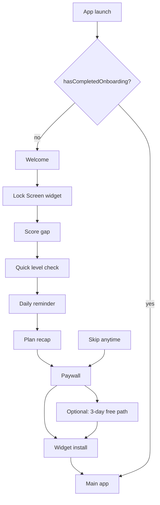

# Glance: SAT® Vocab Prep — Onboarding Scheme & Implementation

**Document purpose:** External review of the current first-run onboarding experience and its technical implementation.  
**Audience:** Product, design, copy, and engineering reviewers.  
**Source of truth:** `GlanceSAT/GlanceSAT/OnboardingView.swift`, `GlanceSATApp.swift` (as of May 2026).  
**Note:** An older brief exists at `Glance_Onboarding_Brief.md`; this document reflects the **live** flow (8 screens, revised pricing, widget-install step, 3-day preview path).

---

## 1. Product thesis

Glance is an SAT vocabulary app built around a passive-first learning loop:

**Passive exposure first. Active recall later.**

Students already check their phones many times per day. Glance turns Lock Screen glances into repeated exposure to high-impact SAT words, then uses one short daily quiz to test what actually stuck.

Onboarding must establish three beliefs before monetization:

1. Glance is not another heavy “study app.”
2. The Lock Screen widget is the breakthrough, not a side feature.
3. Premium unlocks a personalized quiet-learning plan the user just configured—not a generic feature list.

---

## 2. Entry & completion (app shell)

| Mechanism | Storage key | Behavior |
|-----------|-------------|----------|
| Onboarding gate | `hasCompletedOnboarding` (`UserDefaults` / `@AppStorage`) | `false` → show `OnboardingView`; `true` → main app (`Today` / `Library` / `Insights`) |
| Completion callback | `OnboardingView.onFinish` | Sets `hasCompletedOnboarding = true` with animation in `GlanceSATApp` |
| Debug replay | Settings debug menu | “Replay onboarding” sets `hasCompletedOnboarding = false` |

First launch: user sees onboarding only. No separate login. All personalization is local until StoreKit is wired.

---

## 3. Screen flow (8 steps)

| # | Phase | Kind | Eyebrow | Primary CTA |
|---|-------|------|---------|-------------|
| 1 | Discover | Welcome | Welcome to Glance | Begin |
| 2 | Discover | Lock Screen widget | The breakthrough | Show Me How It Works |
| 3 | Personalize | Score gap | Your score gap | Save My Score Gap |
| 4 | Personalize | Quick level check | Quick check | Save My Baseline *(blocked until 4/4 answered)* |
| 5 | Activate | Daily reminder | One notification | Set My Daily Check-In |
| 6 | Activate | Plan recap | Your plan is ready | Unlock My Plan |
| 7 | Unlock | Premium paywall | Glance Premium | Start 7-Day Free Trial |
| 8 | Activate | Widget install | Activate the breakthrough | Done - My Widget Is Live |

**Removed vs. older brief:** standalone “Method” screen; separate “prior SAT” and “target score” screens (now one **Score gap** screen).

### Phase labels (progress UI)

- **Discover** — steps 1–2  
- **Personalize** — steps 3–4  
- **Activate** — steps 5–6 and 8  
- **Unlock** — step 7  

Bottom chrome: phase name + `N/8` + slim horizontal progress bar. No page dots.

### Navigation rules

- **Forward:** Primary CTA advances `TabView` page index (except paywall → widget install; widget install → complete).
- **Skip:** Visible on all steps except paywall and widget install. Jumps directly to **paywall** (index of `.paywall` kind).
- **No vertical scrolling:** Each screen uses compact spacing, line limits, and `GeometryReader` height checks (`isCompact` when height &lt; 650pt).

---

## 4. Screen-by-screen detail

### 4.1 Welcome

- **Title:** Vocabulary prep that fits into the day you already have.  
- **Body:** Absorb high-impact SAT words through quiet Lock Screen exposure, then check what stayed with one short daily quiz.  
- **Hero capsule:** Passive exposure first. Active recall later.  
- **Visual:** Glass card with sparkle icon; mini timeline Glance → Recall → Adapt.  
- **Job:** Warmth, low resistance, calm positioning.

### 4.2 Lock Screen widget

- **Title:** Your Lock Screen becomes the study space.  
- **Hero:** Phone mockup showing widget word `cogent` + definition.  
- **Proof:** “150+ daily Lock Screen moments” / “Use attention you already spend.”  
- **Job:** Widget = core mechanism, not accessory.

### 4.3 Score gap (combined personalization)

Single screen replaces prior SAT + target score flows.

**UI components:**

- Visual **spectrum** (400–800) with current vs goal markers.  
- Two steppers: **Starting point** and **Goal** (± adjusts discrete score bands).  
- Toggle: **First SAT** vs **I have a score** (stores `hasTakenSATBefore`: `notYet` | `taken`).  
- If “I have a score,” starting bands: Under 550, 550-620, 630-690, 700-740, 750+.  
- Goal bands: 600+, 650+, 700+, 750+, 800.

**Copy guardrail:** “Ranges are enough. This is context, not a prediction.”

**Stored:**

| Key | Values |
|-----|--------|
| `hasTakenSATBefore` | `notYet`, `taken` |
| `previousReadingWritingScoreRange` | e.g. `630-690` |
| `verbalScoreGoal` | e.g. `700+` (default) |

### 4.4 Quick level check

- **Format:** 4 questions, one at a time; **binary choice** (2 options per question).  
- **Words shown large** (headword-first, not sentence definitions).  
- **Difficulty ladder:** Warm-up → Medium → Advanced → Elite.  
- **Immediate feedback** on tap (green = correct option, red = wrong selection).  
- Internal “Next” / “Baseline saved” after each answer; global CTA disabled until all four complete (`Finish Level Check`).  
- **Live baseline pill** updates as user progresses (Building / Developing / Strong / Advanced).

**Question bank (implementation):**

| # | Word | Options (correct first) |
|---|------|-------------------------|
| 1 | cogent | convincing / careless |
| 2 | mitigate | make less severe / make more intense |
| 3 | tenuous | weakly supported / widely accepted |
| 4 | equivocate | avoid commitment / speak precisely |

**Stored:**

| Key | Format |
|-----|--------|
| `onboardingDiagnosticAnswers` | `0:0,1:1,...` comma-separated |
| `onboardingDiagnosticCorrectCount` | 0–4 |

### 4.5 Daily check-in reminder

- **Default:** 7:00 PM (`dailyQuizReminderHour` = 19, `dailyQuizReminderMinute` = 0).  
- **Controls:** ±15 min, presets 6 PM–9 PM.  
- **On CTA:** Requests notification permission; schedules repeating local notification (`QuizReminderScheduler`).  
  - Title: Evening check-in  
  - Body: Take your daily Glance quiz and see what stayed with you.  
  - Identifier: `daily-quiz-reminder`

### 4.6 Plan recap

Summarizes user inputs before paywall:

- Score gap: `{starting} → {goal}`  
- Level check: baseline label  
- Daily check-in: formatted time  
- Method: Lock Screen + adaptive review  

**CTA:** Unlock My Plan → advances to paywall.

### 4.7 Premium paywall

**Positioning:** Unlock the plan just built; annual plan framed for full prep cycle.

**Pricing (UI):**

| Plan | Price | Default selection |
|------|-------|-------------------|
| Full SAT Prep | $49.99 / year | **Yes** (`OnboardingPlan.fullPrep`) |
| Monthly | $7.99 / month | No |

**Also shown:**

- Compact pills: Goal, Level, Check-in  
- 7-day trial timeline: Today → Day 5 reminder → Day 7 billing begins  
- Feature grid: Daily quiz, Full word bank, Widget Studio, Quiet insights  
- Secondary: **Try Glance Free for 3 Days** (no card; 72-hour full access)  
- Microcopy under secondary: “No card needed. Full access for 72 hours.”

**Primary CTA behavior (implementation):**

- Does **not** complete onboarding immediately.  
- Navigates to **Widget install** screen (activation before exit).  
- **StoreKit:** Not wired; trial/purchase is visual only.

**3-day preview path:**

- Sets `hasStartedNoCardPreview = true`, `noCardPreviewStartedAt` = timestamp.  
- Then same widget-install navigation as primary CTA.

### 4.8 Widget install

- **Title:** Put Glance on your Lock Screen.  
- **Steps:** Long-press Lock Screen → Customize → Choose Glance.  
- **Primary CTA:** Done - My Widget Is Live → sets `hasMarkedWidgetInstalled = true`, completes onboarding.  
- **Secondary:** I'll Do This Later → schedules one-time nudge in 2 hours (`widget-install-reminder`), then completes onboarding.

---

## 5. Visual & UX system

| Element | Implementation |
|---------|----------------|
| Background | `HubPalette.linen` + soft amber/ember gradient orbs |
| Typography | SF Pro; semibold titles; restrained body |
| Cards | `.thinMaterial` / `.ultraThinMaterial`, continuous corners, light strokes |
| Accent | `HubPalette.ember` for eyebrows, badges, progress |
| Primary CTA | Espresso capsule, full width, fixed bottom area |
| Motion | `easeInOut` ~0.22–0.24s on page changes |

**Layout pattern (typical page):** Top brand bar (`Glance` + optional Skip) → hero → eyebrow/title/body → step-specific controls → fixed bottom progress + CTA.

---

## 6. Data captured at onboarding

All via `@AppStorage` unless noted:

| Key | Purpose |
|-----|---------|
| `hasCompletedOnboarding` | Gate main app |
| `hasTakenSATBefore` | First SAT vs prior score |
| `previousReadingWritingScoreRange` | Prior R&W band |
| `verbalScoreGoal` | Target band |
| `onboardingDiagnosticAnswers` | Per-question answer indices |
| `onboardingDiagnosticCorrectCount` | Baseline tier |
| `dailyQuizReminderHour` / `dailyQuizReminderMinute` | Evening quiz reminder |
| `hasStartedNoCardPreview` | 3-day preview flag |
| `noCardPreviewStartedAt` | Preview start epoch |
| `hasMarkedWidgetInstalled` | User tapped “widget is live” |

**Not persisted in onboarding UI:** selected subscription plan (in-memory `@State` only until StoreKit exists).

---

## 7. Technical implementation

### 7.1 Primary file

- **`OnboardingView.swift`** (~1,420 lines) — entire flow, copy, visuals, persistence, notifications.  
- **`GlanceSATApp.swift`** — hosts onboarding vs `AppRootView` based on `hasCompletedOnboarding`.

### 7.2 Structure

```
OnboardingView
├── @AppStorage (personalization + flags)
├── TabView (page index, page style hidden)
│   └── OnboardingPageView × 8 (OnboardingPage.all)
├── topBar (brand + Skip)
└── bottomControls (progress + primary CTA + conditional secondary)

OnboardingPage / OnboardingPageKind — static copy + metadata
DiagnosticQuestionBank — 4 questions
QuizReminderScheduler — UNUserNotificationCenter
```

### 7.3 Async / side effects

| Action | When | Blocking? |
|--------|------|-----------|
| Schedule daily reminder | Reminder step CTA | `Task { await QuizReminderScheduler... }` — non-blocking |
| Widget install nudge | “Later” on install screen | Background `Task` |
| Notification permission | Inside scheduler | Failure swallowed (onboarding never blocks) |

### 7.4 Post-onboarding product hooks

| Feature | Connection to onboarding |
|---------|---------------------------|
| **Widget snapshot** | Written after batch refresh; not during onboarding |
| **Onboarding boss words** | Words in `Database.json` with `onboardingRank` (1–3) prioritized in `DailyWordBatchService` and connotation “boss” quiz in `QuizGenerator` |
| **SRS from widget** | Separate path: `WidgetPendingEventsStore` + `WidgetInteractionReconciler` (Know events). Quiz widget answers queue `quizAnswer` events—reconciled when app opens |
| **3-day preview** | Flags stored; enforcement logic should be verified where paywall/access is implemented |

---

## 8. Monetization & conversion design

| Principle | How onboarding applies it |
|-----------|---------------------------|
| Clarity | Widget + passive loop explained early |
| Low friction | Short diagnostic; skip to paywall allowed |
| Investment | Score gap + 4-question baseline |
| Plan ownership | Recap before paywall |
| Loss aversion | “Unlock my plan” framing |
| Trust | No score guarantees; “ranges are enough” |
| Activation | Widget install after paywall CTA |

**Highest-risk friction:** Quick level check (required for forward on that step).  
**Highest-leverage conversion:** Recap → paywall → widget install sequence.

---

## 9. Gaps & implementation notes (for reviewers)

1. **StoreKit:** Paywall CTAs do not start real subscriptions; they advance onboarding UI only.  
2. **3-day preview:** `hasStartedNoCardPreview` is written; confirm gating is enforced app-wide.  
3. **Skip to paywall:** Skips education (reminder, recap) and personalization commitment on skipped pages—intentional for escape hatch.  
4. **Method screen removed:** Spaced repetition story now lives in welcome hero, recap row, and in-app—not a dedicated onboarding page.  
5. **Brand naming:** In-app chrome uses **Glance**; App Store / legal name may be **Glance: SAT® Vocab Prep** (SAT® trademark on SAT only).

---

## 10. Questions for external feedback

Use these when reviewing:

### Product & narrative
1. Does the passive-first thesis land in the first two screens?  
2. Is the Lock Screen widget clearly the hero?  
3. Is eight steps the right length, or does it feel long/short?

### Personalization
4. Does the combined **Score gap** screen feel clear vs. the old two-screen flow?  
5. Is the spectrum + stepper UI intuitive for teens/parents?  
6. Does the quick check feel valuable or like friction?

### Monetization
7. Does recap make the paywall feel personalized?  
8. Is **Full SAT Prep** at $49.99/yr compelling vs. $7.99/mo?  
9. Is the **3-day no-card preview** attractive or confusing next to **7-day trial**?  
10. Should primary paywall CTA complete onboarding immediately if the user already paid (future StoreKit)?

### Activation
11. Is widget install the right **last** step (after paywall)?  
12. Does “I'll Do This Later” feel acceptable or too many drop-offs?  
13. Is evening reminder copy reassuring?

### Copy & trust
14. Any copy feel too salesy, repetitive, or unclear?  
15. Does the tone feel premium and calm enough for SAT parents/students?

---

## 11. Appendix: Flow diagram



---

## 12. Related files (engineering)

| File | Role |
|------|------|
| `GlanceSAT/GlanceSAT/OnboardingView.swift` | Full UI + logic |
| `GlanceSAT/GlanceSAT/GlanceSATApp.swift` | Gate + `onFinish` |
| `GlanceSAT/GlanceSAT/DailyWordBatchService.swift` | `onboardingRank` word priority |
| `GlanceSAT/GlanceSAT/QuizGenerator.swift` | Boss-fight connotation quiz for ranked words |
| `GlanceSAT/GlanceSAT/WidgetInteractionReconciler.swift` | Post-widget SRS (Know / quizAnswer) |
| `Glance_Onboarding_Brief.md` | Older narrative doc (9-screen version) |

---

*End of document. For questions about this review, contact the product owner.*
