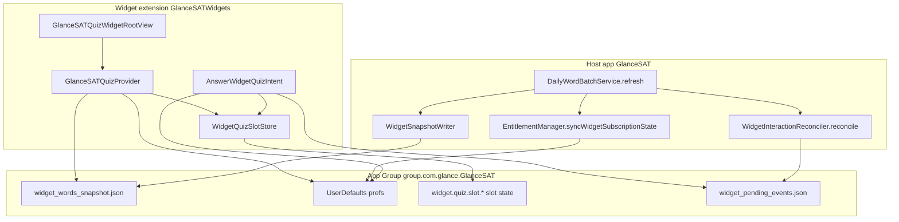
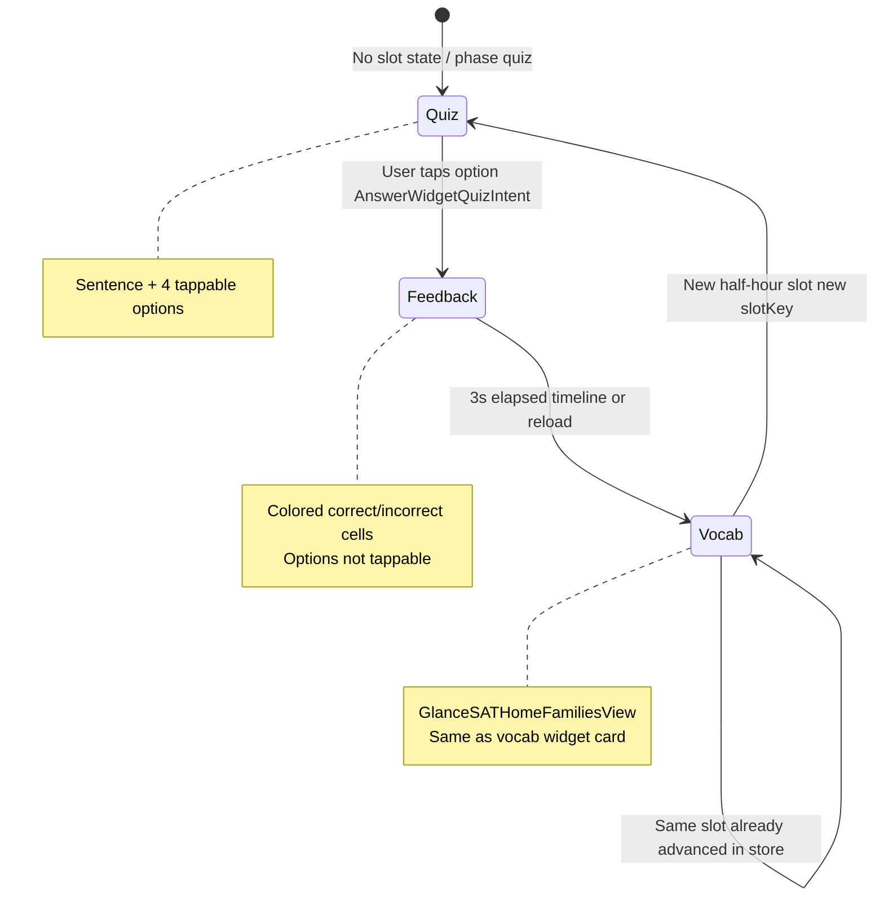
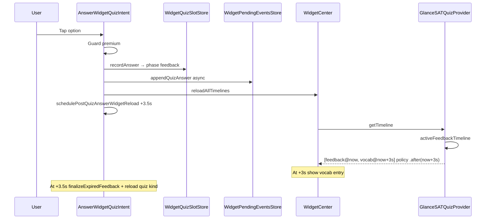

# GlanceSAT — Home Screen Quiz Widget

| Field | Value |
|-------|--------|
| **Audience** | Engineering, product, support |
| **Widget name (picker)** | Glance SAT Quiz |
| **Widget kind** | `com.mikihill.GlanceSAT.quiz` |
| **Families** | `systemMedium`, `systemLarge` only |
| **Related** | [GlanceSAT_Widget_Daily_Rotation.md](GlanceSAT_Widget_Daily_Rotation.md), [GlanceSAT_Widget_Data_and_Timeline.md](GlanceSAT_Widget_Data_and_Timeline.md), [GlanceSAT_Todays_10_Daily_Words.md](GlanceSAT_Todays_10_Daily_Words.md) |

---

## Executive summary

The **Glance SAT Quiz** home-screen widget is a **premium-only** sentence-completion surface. It does **not** query SwiftData at runtime. Like the vocabulary widget, it reads **`widget_words_snapshot.json`** from the App Group, uses **today’s** word list, and rotates on a **30-minute grid** (48 slots per local day).

Unlike the vocabulary widget, it shows the word at index **`(vocabIndex + 1) % N`** in each slot, can present an **interactive quiz** (four options via App Intent), holds **answered feedback for 3 seconds**, then shows the **same word card** as the vocabulary widget (hook / example buttons on medium & large).

**Primary daily quiz completion in the app does not change quiz widget behavior** (no celebration, no post-quiz layout). Freemium **daily limit lock** applies to the **vocabulary** widget only; the quiz widget is either **unlocked (premium / trial)** or **fully locked** with “Unlock the quiz widget.”

---

## 1. Architecture overview



| Layer | Responsibility |
|-------|----------------|
| **Host** | Build daily batches, write snapshot + quiz sentences, reconcile SRS from widget taps, sync subscription flags |
| **App Group** | Shared JSON snapshot, quiz slot state, pending events queue, widget prefs |
| **Extension** | TimelineProvider, UI, App Intents (answer / no SwiftData in intent hot path) |

### Key source files

| Area | File |
|------|------|
| Widget registration | `GlanceSATWidgets/GlanceSATQuizWidget.swift` |
| Timeline + entries | `GlanceSATWidgets/GlanceSATQuizWidget.swift` (`GlanceSATQuizProvider`) |
| Slot / phase state | `GlanceSATWidgets/WidgetQuizSlotStore.swift` |
| UI | `GlanceSATWidgets/GlanceSATQuizWidgetViews.swift` |
| Answer intent | `GlanceSATWidgets/WidgetWordIntents.swift` (`AnswerWidgetQuizIntent`) |
| Rotation helpers | `GlanceSATWidgets/WidgetTimelineBuilder.swift`, `WidgetSlotClock.swift` |
| Snapshot read | `GlanceSATWidgets/WidgetPayload.swift` (`WidgetPayloadLoader`) |
| Snapshot write | `GlanceSAT/WidgetSnapshotWriter.swift`, `WidgetSentenceQuizBuilder.swift` |
| Reload scheduling | `GlanceSATWidgets/WidgetIntentReload.swift`, `GlanceSAT/WidgetTimelineReloader.swift` |
| SRS reconcile | `GlanceSAT/WidgetInteractionReconciler.swift`, `WidgetReconcileActor.swift` |

---

## 2. How the widget receives data

### 2.1 Snapshot file (read-only in extension)

| Property | Value |
|----------|--------|
| Path | App Group container / `widget_words_snapshot.json` |
| Loader | `WidgetPayloadLoader.load()` (cached by file modification date) |
| Schema | `WidgetSnapshotPayload` — `dailyBatches: [yyyy-MM-dd: [WidgetWordSnapshot]]` |

Each `WidgetWordSnapshot` includes quiz fields:

| Field | Source (host) |
|-------|----------------|
| `sentenceQuizPrompt` | Active slot’s prompt text |
| `synonymQuizOptions` | Four distractors + correct (widget quiz generator) |
| `synonymQuizCorrectAnswer` | Correct option string |
| `sentenceQuizSlots` | Up to **3** variants from `exampleSentence`, `widgetSentence2`, `widgetSentence3` |

**Important:** Widget quizzes use **`widgetSentence2` / `widgetSentence3`**, not the in-app daily quiz’s `quizSentence`. Built in `WidgetSentenceQuizBuilder.apply` when the host writes the snapshot.

### 2.2 When the snapshot is written

`WidgetSnapshotWriter.writeSnapshot` runs from `DailyWordBatchService.refresh` after today’s (and rolling future) batches are resolved. Typical triggers:

| Trigger | Also reloads widgets? |
|---------|------------------------|
| App becomes **active** | `refreshWidgetDataFromHost()` → refresh → `scheduleVocabularyReload()`; full reload if queue day changed |
| App enters **background** | `WidgetCenter.reloadAllTimelines()` |
| Daily batch first created / past days archived | `scheduleAllWidgetReload()` |
| Widget Studio / settings / entitlement changes | `reloadAllTimelines()` or targeted reload |
| Midnight / timezone change | Next refresh recomputes `todayKey` |

The quiz widget **does not** get a dedicated reload on every refresh unless `scheduleAllWidgetReload()` runs or something calls `reloadAllTimelines()` / `reloadTimelines(ofKind: quizKind)`.

### 2.3 UserDefaults prefs (extension reads)

| Key | Purpose |
|-----|---------|
| `widget.subscription.hasPremium` | Premium / trial → quiz widget usable |
| `widget.prefs.theme` / `typography` | Card chrome (vocab phase) |
| `widget.interactions.dismissedWordIDs` | Words hidden from rotation (`WidgetInteractionStore.visibleWords`) |
| `widget.quiz.slot.{slotKey}` | Per-slot quiz phase state (JSON `WidgetQuizSlotState`) |

Written by host via `WidgetSubscriptionPrefs.write` (`EntitlementManager.syncWidgetSubscriptionState`). Slot keys written by extension via `WidgetQuizSlotStore`.

### 2.4 Slot key format

```text
slotKey = "{calendarDayKey}_{slotIndex}"
Example: 2026-06-03_14   → 3:00 PM–3:29 PM slot on that local day
```

`slotIndex` = `floor(minutesSinceMidnight / 30)`, clamped 0…47 (`WidgetSlotClock.slotIndex`).

---

## 3. Word & sentence rotation

### 3.1 Which word appears

Same daily array as the vocabulary widget, but **index offset +1**:

```text
vocabIndex = slot % wordCount
quizIndex  = (vocabIndex + 1) % wordCount
```

At **noon** with 10 words: if Glance vocab shows **W4**, Glance Quiz shows **W5** (or **W0** if vocab is **W9**).

### 3.2 Which sentence variant (3 slots)

Within a half-hour slot, the **prompt/options** can rotate across up to **3** pre-built `sentenceQuizSlots`:

```text
sentenceSlotIndex = slotIndex % 3
word' = word.withSentenceQuizSlot(sentenceSlotIndex)
```

So the headword may repeat across the day, but the **blank sentence** cycles through three widget-only examples.

### 3.3 Timeline entry schedule (normal day)

`GlanceSATQuizProvider.buildQuizEntries`:

1. `remainingHalfHourSlotDates(from: now)` → every remaining `:00` / `:30` through 23:30, plus `now` if needed.
2. For each `slotDate`, `makeEntry(...)` with that slot’s `slotKey` and `WidgetTimelineBuilder.quizWord(at:in:)`.
3. Entries sorted and deduped (within 0.5s, same phase + same word id).

**Reload policy:** `TimelineReloadPolicy.atEnd` — WidgetKit reloads after the **last** entry time (typically after today’s final scheduled slot).

WidgetKit shows the entry with the **latest `date` ≤ current time**.

---

## 4. Display phases (quiz → feedback → vocab)



| Phase | `WidgetQuizDisplayPhase` | UI component | How entered |
|-------|--------------------------|--------------|-------------|
| **Quiz** | `.quiz` | `GlanceSATQuizPromptView` — prompt + `AnswerWidgetQuizIntent` buttons | Default when no `WidgetQuizSlotState` for this `slotKey` + `wordID` |
| **Feedback** | `.feedback` | Same view, `isFeedback` — styled options, no buttons | `WidgetQuizSlotStore.recordAnswer` |
| **Vocab** | `.vocab` | `GlanceSATHomeFamiliesView` | Timeline entry after 3s, or store `phase == .vocab`, or word has no quiz data |

### Words without quiz data

If `word.hasSentenceQuiz` is false (empty prompt, &lt;2 options, or no correct answer), `makeEntry` forces **`.vocab`** for that slot — user only sees the word card.

---

## 5. Per-slot state (`WidgetQuizSlotStore`)

Persisted under App Group UserDefaults:

```text
Key:   widget.quiz.slot.{slotKey}
Value: JSON WidgetQuizSlotState {
  wordID, phase, selectedOption, wasCorrect, answeredAt
}
```

| `phase` | Meaning |
|---------|---------|
| `.quiz` | Not used in storage (absence = quiz) |
| `.feedback` | Answered; show feedback UI until hold ends |
| `.vocab` | User saw feedback; show word card for rest of this slot |

**Slot keys include the calendar day**, so state does not bleed across midnight (`2026-06-02_14` vs `2026-06-03_14`).

**Not automatically cleared** at end of day; orphaned keys are harmless because `matchingState` requires matching `wordID` for the current word in that slot.

### Resolved phase (timeline building only)

`resolvedPhase(slotKey:wordID:now:)` is used when **building** rotation entries in `makeEntry`. It treats `.feedback` as `.vocab` once `now >= answeredAt + 3s` even before `finalizeExpiredFeedback` runs.

**Rendering** uses **`entry.displayPhase` from the timeline**, not live `resolvedPhase`, so WidgetKit entry transitions drive the UI.

---

## 6. Answering a question (in-widget)

### 6.1 Flow



### 6.2 `AnswerWidgetQuizIntent.perform()` (hot path)

1. **Premium guard** — no-op if `!WidgetPrefsReader.hasPremiumAccess()`.
2. **`WidgetQuizSlotStore.recordAnswer`** — synchronous UserDefaults write (`phase: .feedback`, `answeredAt: now`).
3. **`WidgetPendingEventsStore.appendQuizAnswer`** — detached task; queues SRS event for host (no SwiftData in extension).
4. **`WidgetCenter.shared.reloadAllTimelines()`** — immediate timeline rebuild.
5. **`WidgetIntentReload.schedulePostQuizAnswerWidgetReload()`** — backup at **3.5s** (`widgetTimelineFeedbackHold` 3.0 + 0.5).

Correctness: case-insensitive trim compare (`WidgetQuizSlotStore.isCorrect`).

### 6.3 Feedback timeline (short-circuit)

When `anyActiveFeedback(now:)` finds `phase == .feedback` and `now < answeredAt + 3s`:

| Entry | `date` | `displayPhase` | Policy |
|-------|--------|----------------|--------|
| 1 | `now` | `.feedback` | |
| 2 | `now + 3s` | `.vocab` | `TimelineReloadPolicy.after(now + 3s)` |

Returns **only these two entries** — does not build the full 48-slot day until feedback ends.

`anyActiveFeedback` picks the **most recent** `answeredAt` across all slot keys (handles slot lag after reload).

### 6.4 Feedback → vocab transition (without opening app)

| Mechanism | What it does |
|-----------|----------------|
| **Timeline entry switch** | At `transitionDate`, WidgetKit activates entry 2 with `displayPhase: .vocab` |
| **View gating** | `GlanceSATQuizWidgetRootView` uses `entry.displayPhase` (not live clock) |
| **Backup reload** | At 3.5s: `finalizeExpiredFeedback()` sets `phase: .vocab` in store; `reloadTimelines(ofKind: quizKind)` |

Constants (keep in sync):

| Constant | Value | Location |
|----------|-------|----------|
| `widgetTimelineFeedbackHold` | **3.0 s** | `WidgetQuizSlotStore` |
| Post-answer reload delay | **3.5 s** | `WidgetIntentReload`, `WidgetTimelineReloader` |

### 6.5 SRS / database (deferred)

| Step | When |
|------|------|
| Event queued | Immediately in extension → `widget_pending_events.json` |
| Event drained | `WidgetInteractionReconciler.reconcile` during next `DailyWordBatchService.refresh` |
| SRS applied | `WidgetReconcileActor` — `quizAnswer` → quality 5 (correct) or 1 (incorrect) |

Opening the app triggers `refreshWidgetDataFromHost` on **active**, which reconciles pending widget quiz answers into SwiftData.

---

## 7. When the widget updates (reload matrix)

| Event | Quiz timeline reload? | Typical result |
|-------|-------------------------|----------------|
| User answers on widget | **Yes** — immediate `reloadAllTimelines` + 3.5s quiz kind | Feedback timeline |
| Half-hour boundary | WidgetKit advances existing entry **if** full-day timeline was built | Next word/slot |
| `getTimeline` at end of day | `.atEnd` policy | Full rebuild next reload |
| App → active | `refresh` → snapshot rewrite; often `scheduleVocabularyReload` only | Quiz reloads when WidgetKit coalesces or on `reloadAll` paths |
| App → background | `reloadAllTimelines` | All widgets refresh |
| Entitlement change | `reloadAllTimelines` | Locked vs unlocked |
| Daily batch / new day | `scheduleAllWidgetReload` | New words + cleared day context |
| Lock screen / vocab-only settings | Vocabulary kinds only | Quiz unchanged unless all timelines reload |

**Note:** After in-widget answer, vocabulary widget also reloads (`reloadAllTimelines`) but keeps normal rotation — no special feedback UI on vocab widget.

---

## 8. What happens when the app is opened

### 8.1 Foreground (`scenePhase == .active`)

1. **`refreshWidgetDataFromHost()`** → `DailyWordBatchService.refresh`:
   - Drains **`widget_pending_events.json`** and applies widget quiz SRS.
   - Refreshes rolling batch queue if needed.
   - Rewrites **`widget_words_snapshot.json`** (quiz sentences regenerated from DB).
   - `EntitlementManager.syncWidgetSubscriptionState()` — updates premium / freemium limit flags (vocab lock only).
   - `WidgetTimelineReloader.scheduleVocabularyReload()` (and sometimes `scheduleAllWidgetReload()`).

2. **Does not** explicitly reset `WidgetQuizSlotStore` — in-progress feedback for current slot persists until 3s elapses or `finalizeExpiredFeedback` on next `getTimeline`.

3. User may see quiz widget jump to vocab if feedback expired while app was closed and WidgetKit reloads.

### 8.2 Deep link

Widget sets `WidgetDeepLink.libraryURL(wordID:)` on vocab phase (and quiz prompt background). Opening URL routes in host (`WidgetDeepLinkRouter`) — independent of timeline.

### 8.3 Primary daily quiz completed in app

| System | Behavior |
|--------|----------|
| `WidgetDailyState.markPrimaryQuizCompleted` | Sets `widget.primaryQuizCompletedDayKey`, streak — **vocabulary** freemium lock |
| Quiz widget | **No** celebration, **no** post-quiz-only layout; keeps rotating + in-slot phases |
| Quiz widget lock | Still only **premium gate** — not “daily limit reached” |

Completing the **in-app** daily quiz does **not** write `WidgetQuizSlotStore` for home-screen slots unless the user also answered on the widget.

---

## 9. Premium lock vs stale snapshot

| Condition | UI |
|-----------|-----|
| `!hasPremiumAccess` (live, not gallery) | `GlanceSATQuizWidgetLockedView` — “Unlock the quiz widget” → paywall deep link |
| No batch for widget local `todayKey` | Single entry, `isStaleSnapshot: true` — “Open GlanceSAT to refresh” |
| Gallery / placeholder | `WidgetGalleryPreview.quizEntry()` — laconic sample sentence |

Locked timeline: one entry, `policy: .atEnd`, `displayPhase: .vocab` (placeholder word).

---

## 10. UI details

### 10.1 Quiz prompt (`GlanceSATQuizPromptView`)

- Centered **sentence completion** prompt (`sentenceQuizPrompt`).
- **2×2 grid** of options (`synonymQuizOptions.prefix(4)`).
- **Quiz phase:** each option is a `Button` with `AnswerWidgetQuizIntent`.
- **Feedback phase:** plain `Text` cells — correct = green fill, wrong selection = red, others dimmed.
- Colors aligned with in-app quiz (`WidgetQuizChrome` ↔ `DailyQuizChrome`).

### 10.2 Vocab phase

Reuses **`GlanceSATHomeFamiliesView`** (medium/large): word, definition with POS, hook / example App Intent tray — same behavior as the vocabulary home widget for that word.

### 10.3 `isResting`

Timeline production **never** sets `isResting: true`. Branch exists for previews / legacy; live timelines use normal rotation or stale/locked states.

---

## 11. Gallery / WidgetKit preview

| Context | Entry |
|---------|--------|
| `placeholder` / `isPreview` | `WidgetGalleryPreview.quizEntry()` — word **laconic**, hard SAT-style prompt |
| `isGalleryPreview: true` on entry | Skips premium lock |

---

## 12. Debugging checklist

| Symptom | Check |
|---------|--------|
| Stuck on feedback after answer | Timeline has vocab entry at `now+3`? View using `entry.displayPhase`? Backup reload at 3.5s firing? |
| Stuck on quiz after answer | `reloadAllTimelines` after intent? `anyActiveFeedback` finding state? Premium true? |
| Wrong word vs vocab widget | Expected: quiz index = vocab + 1 mod N |
| No sentence / vocab only | `hasSentenceQuiz` false in snapshot — inspect `WidgetSentenceQuizBuilder` / word sentences |
| Locked while subscribed | `widget.subscription.hasPremium` in App Group; `reapplyAccess` |
| SRS not updating | `widget_pending_events.json` draining on refresh? `WidgetReconcileActor` applied keys? |
| Old slot odd behavior | Inspect `widget.quiz.slot.*` keys in App Group for stale `feedback` phase |

### Useful DEBUG flows

- **Simulate free user** — quiz widget shows lock overlay.
- Answer on widget without opening app — should flip to vocab card at **~3 seconds**.

---

## 13. Constants reference

| Constant | Value |
|----------|--------|
| `GlanceSATWidgetConstants.quizKind` | `com.mikihill.GlanceSAT.quiz` |
| `rotationIntervalMinutes` | 30 |
| `timelineSlotsPerDay` | 48 |
| `widgetTimelineFeedbackHold` | 3.0 s |
| `widgetQuizSentenceSlotCount` | 3 |
| Pending events cap | 80 |

---

## 14. Relationship to vocabulary widget

| Aspect | Vocabulary widget | Quiz widget |
|--------|-------------------|-------------|
| Families | Small / medium / large + lock accessories | Medium / large only |
| Word index | `slot % N` | `(slot % N) + 1` |
| Interactivity | Hook / example toggles | Sentence quiz + then vocab card |
| Premium | Freemium 3 words; lock after daily quiz | All-or-nothing premium gate |
| Post-quiz celebration | Removed | Never had separate celebration |
| Shared snapshot | Yes — same `widget_words_snapshot.json` |

---

*Last updated: June 2026 — reflects removal of widget post-quiz celebration and feedback transition fix (timeline-driven `displayPhase`).*
