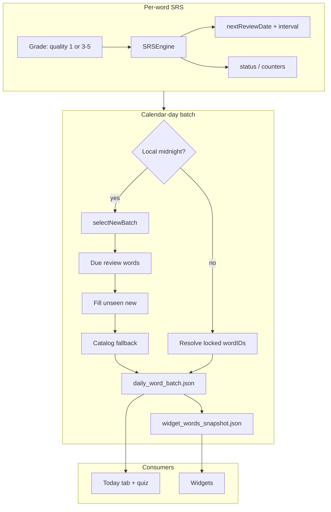

# GlanceSAT — SRS algorithm & daily word selection

| Field | Value |
|-------|--------|
| **Audience** | Engineering, product, pedagogy |
| **Source of truth** | `SRSEngine.swift`, `DailyWordBatchService.swift`, `SupplementalQuizPlanner.swift`, `Word.swift` |
| **Last updated** | June 2026 |

---

## Executive summary

GlanceSAT uses **per-word spaced repetition** (SM-2–style) stored on each `Word` in SwiftData. A separate **calendar-day batch** picks up to **10 headwords per local day** (3 for freemium, 10 for premium) that stay **fixed until midnight**, shared by Today, the primary daily quiz, and home-screen widgets.

There is **no global queue** beyond sort descriptors and deterministic day-keyed shuffles.

---

## Part 1 — Spaced repetition (`SRSEngine`)

**File:** `GlanceSAT/GlanceSAT/SRSEngine.swift`  
**Entry point:** `SRSEngine.calculateNextReview(word:quality:reviewedAt:)`

### 1.1 Learner fields on `Word`

| Field | Default | Role |
|-------|---------|------|
| `easeFactor` | `2.5` | Multiplier for interval growth on success; reduced on failure |
| `interval` | `1` | Days until next review after the latest grade |
| `status` | `"new"` | `"learning"` → `"review"` → `"mastered"` (see below) |
| `nextReviewDate` | import time | Word is **due** when `nextReviewDate <= now` |
| `lastReviewDate` | `nil` | Last graded interaction (any quality) |
| `lastSuccessfulReviewDate` | `nil` | Last success only (`quality >= 3`); Insights “weekly remembered” |
| `totalAttempts` | `0` | +1 every `calculateNextReview` call |
| `successfulRecalls` | `0` | +1 on success only |
| `consecutiveCorrect` | `0` | Reset to 0 on failure; drives `status` |

Bundled JSON metadata (`frequencyRank`, `difficulty`, `onboardingRank`, etc.) is **not** overwritten by SRS. Import only syncs lexical fields (`WordJSONImportService`).

### 1.2 Quality scale

`quality` must be in `0...5`. The app uses:

| Source | Incorrect | Correct (fast) | Correct (medium) | Correct (slow) |
|--------|-----------|----------------|------------------|----------------|
| **Daily quiz** (`DailyQuizView`) | `1` | `5` if ≤ 2.5 s | `4` if ≤ 5.0 s | `3` if > 5.0 s |
| **Widget quiz answer** (reconcile) | `1` | `5` | — | — |
| **Widget “know”** (legacy queue) | — | `5` | — | — |

Only items with `QuizQuestion.appliesSRS == true` run SRS in the daily quiz (primary: all true; supplemental **misses**: false; supplemental **fill**: true).

### 1.3 Failure path (`quality < 3`)

1. Recompute ease: `newEase = oldEase - 0.8 + 0.28q - 0.02q²`, clamped to **≥ 1.3** (if word was mastered, ease also capped at **≤ 1.8**).
2. `interval = 1` day.
3. `consecutiveCorrect = 0`.

### 1.4 Success path (`quality >= 3`)

1. Ease: `newEase = min(2.5, max(1.3, oldEase + 0.1 - (5 - quality) * 0.08))`.
2. `consecutiveCorrect += 1`, `successfulRecalls += 1`, `lastSuccessfulReviewDate = reviewedAt`.
3. Interval by streak:
   - 1st success → `interval = 1`
   - 2nd success → `interval = 6`
   - 3rd+ → `interval = max(1, round(oldInterval * newEase))`
4. `nextReviewDate = reviewedAt + interval` calendar days.

### 1.5 Status labels

| Condition | `status` |
|-----------|----------|
| `consecutiveCorrect >= 5` | `"mastered"` |
| `consecutiveCorrect >= 1` | `"review"` |
| else | `"learning"` |

Insights “mastered” counts use **`status == "mastered"`** only.

### 1.6 Who calls SRS

| Caller | When | Notes |
|--------|------|-------|
| `DailyQuizView` | After each answered question | Skips if `!appliesSRS` |
| `WidgetReconcileActor` | On app/batch refresh | Drains `widget_pending_events.json` |
| Widget events | `.know` → quality 5; `.quizAnswer` → 5 or 1 | `.revealExample` / `.review` → no SRS |
| `reviewedAt` | Widget uses **tap time** `min(event.date, Date())` | Quiz uses answer time |

Widget Know/Reveal buttons on the vocabulary widget were removed from the UI; quiz-widget answers still enqueue `.quizAnswer` events.

---

## Part 2 — Daily batch (the “daily 10”)

> **Full walkthrough:** [GlanceSAT_Todays_10_Daily_Words.md](GlanceSAT_Todays_10_Daily_Words.md) — 70/30 split, rolling queue, calendar lock, persisted new/review counts, and diagrams.

**File:** `GlanceSAT/GlanceSAT/DailyWordBatchService.swift`  
**Cap:** `maxDailyWords = 10`; **effective cap** = `FreemiumLimits.effectiveDailyWordCount` (3 free / 10 premium).

### 2.1 What the batch is

- One ordered list of word UUIDs per **calendar day** (`yyyy-MM-dd`, user calendar/time zone).
- Persisted in App Group: **`daily_word_batch.json`** `{ calendarDayKey, wordIDs[], generatedAt }`.
- Written to widgets via **`widget_words_snapshot.json`** (see widget data doc).
- **Previous days** archived to **`daily_batch_history.json`** (up to **60** entries) for supplemental fill.

### 2.2 Calendar-day lock

Once today’s IDs are saved for `calendarDayKey == today`:

- Same-day `refresh()` **only resolves** those UUIDs in order (no due-filter swap-out of the daily ten).
- Words that become due mid-day from widget/quiz SRS **stay** in today’s batch until midnight (by design).
- **Exception:** If persisted batch has fewer IDs than premium cap (e.g. user upgraded 3 → 10), **`backfillDueWords`** adds more due words **same day** without replacing existing IDs.

New selection runs only when:

- Local date rolls to a new `calendarDayKey`, or
- No valid batch exists for today, or
- Stored batch is corrupt / empty / future-dated (clock skew clamp).

### 2.3 Refresh pipeline (`refresh`)

```
1. WidgetInteractionReconciler.reconcile()     // apply pending widget SRS
2. WidgetDailyState.clearIfNotToday()
3. Archive yesterday's wordIDs → batch history (if day changed)
4. If batch exists for today → resolveWords(wordIDs) [+ backfill if under cap]
   Else → selectNewBatch()
5. applySubscriptionCap → persistBatch → WidgetSnapshotWriter.writeSnapshot
6. WidgetTimelineReloader (debounced reload)
```

Triggered from: app launch bootstrap, Today tab sync, scene active, timezone change, quiz completion snapshot refresh, etc.

### 2.4 `selectMixedBatch70_30` (normal path)

Runs whenever a **new** batch is built (`selectNewBatchPool` → used by `refresh` for today and the rolling queue).

**Target split:** ~**70% review** / ~**30% new** (at least **1** new word when `cap ≥ 1`).

| Pool | Predicate | Sort (pre-shuffle) | Quota (cap = 10) |
|------|-----------|-------------------|------------------|
| **Review** | `status != "new"` and `nextReviewDate <= targetDate` | `onboardingRank` ↑, `nextReviewDate` ↑ | **7** |
| **New** | `status == "new"` | `randomSortHash` ↑ | **3** |

Each pool is oversampled (`quota × 4`), shuffled with `DayKeyedRNG(dayKey + "-review"` / `"-new"`), then truncated to quota.

**Deficits:** If reviews are short, fill with extra **new**; if new are short, fill with extra **reviews**.

**Merge:** `reviews + new` → shuffle with `dayKey + "-mixed"` (carousel/quiz order).

**Safety:** If still `< cap`, `selectCatalogFallbackBatch` (frequency/difficulty/onboarding rank, day shuffle, prefer unseen).

**Metadata:** IDs chosen from the new pool are stored in `dailyNewWordIDs[dayKey]` for stable Today “X new · Y review” labels.

**Onboarding seeding:** `selectSeededNewBatch` (difficulty bands from `DiagnosticBaseline`) remains in the file but is **not** invoked by `refresh` as of June 2026.

### 2.5 Sort descriptors (reference)

**Due / review words:**

```text
onboardingRank ↑
nextReviewDate ↑
```

**Catalog fallback:**

```text
frequencyRank ↑
difficulty ↑
onboardingRank ↑
→ DayKeyedRNG(dayKey) shuffle
→ unseen (status "new") before non-new in prefix
```

### 2.6 Deterministic shuffle (`DayKeyedRNG`)

FNV-style hash of `calendarDayKey` (+ optional suffix like `"-review"`) seeds a xorshift RNG. Same calendar day → same shuffle for the same input pool (stable widget word index rotation).

### 2.7 Today tab vs batch

- **Before primary quiz:** `dailyWords` from batch refresh (persisted or new).
- **After primary quiz:** Outcome tags use **frozen** primary `rememberedWordIDs` / `missedWordIDs`; batch IDs unchanged until midnight (calendar lock).
- Carousel label: `Today's Words · {n} new · {r} review` — counts from **`dailyNewWordIDs`** at batch creation, not live `status` after SRS.

### 2.8 Supplemental quiz fill (not the daily ten)

**File:** `SupplementalQuizPlanner.swift` + `selectSupplementalFillWords`

Order for “Take another quiz”:

1. Today’s **missed** daily words (primary misses, not in supplemental remembered).
2. **Due** words from **past daily batches** (history IDs, excluding today + remembered).
3. Any other **due** words (same exclusions).
4. `selectCatalogFallbackBatch` if still short.

Misses in supplemental round: **`appliesSRS = false`**. Fill words: **`appliesSRS = true`**.

---

## Part 3 — End-to-end flow (diagram)



---

## Part 4 — Related files

| Topic | File |
|-------|------|
| SRS math | `SRSEngine.swift` |
| Daily batch | `DailyWordBatchService.swift` |
| Supplemental plan | `SupplementalQuizPlanner.swift` |
| Word model | `Word.swift` |
| Widget SRS queue | `WidgetPendingEventsStore.swift`, `WidgetReconcileActor.swift` |
| Freemium cap | `FreemiumLimits.swift` |
| Quiz SRS flags | `QuizGenerator.swift`, `DailyQuizPersistence.swift` |

For widget timeline behavior, see `GlanceSAT_Widget_Data_and_Timeline.md`. For step-by-step daily selection, see `GlanceSAT_Todays_10_Daily_Words.md`. For a broader algorithm index, see `GlanceSAT_Algorithms_Reference.md`.
