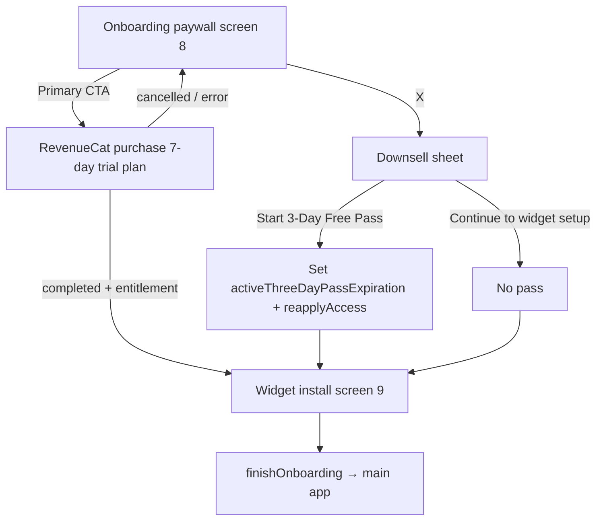

# GlanceSAT — 3-Day Full Access Pass (No-Card Preview)

**Document purpose:** How users are treated when they decline the onboarding subscription paywall (tap **X**) and optionally claim the **3-day full access pass** — versus continuing as **freemium**.  
**Audience:** Product, support, legal, engineering.  
**Source of truth:** `EntitlementManager.swift`, `OnboardingView.swift` (`OnboardingPaywallScreen`, `OnboardingThreeDayDownsellSheet`), `FreemiumLimits.swift`, `DailyWordBatchService.swift`, `PaywallPresenter.swift`, widget prefs in `WidgetSubscriptionPrefs` / `WidgetPrefsReader`.  
**Related:** [GlanceSAT_Todays_10_Daily_Words.md](./GlanceSAT_Todays_10_Daily_Words.md), [GlanceSAT_Onboarding_Current.md](./GlanceSAT_Onboarding_Current.md), [GlanceSAT_Terms_of_Use.md](./GlanceSAT_Terms_of_Use.md) §7.4, [GlanceSAT_User_Facing_Messages.md](./GlanceSAT_User_Facing_Messages.md).

---

## 1. Executive summary

Glance offers **two different “trial” concepts**:

| Offer | Billing | Where started | Access mechanism |
|-------|---------|---------------|------------------|
| **7-day free trial** | Apple / RevenueCat subscription (card on file with Apple) | Onboarding paywall primary CTA **Start my 7-day free trial** or in-app paywall | `premium_access` entitlement via RevenueCat |
| **3-day full access pass** | **No card**, no App Store transaction | Onboarding only: paywall **X** → downsell sheet **Start 3-Day Free Pass** | Local expiration timestamp on device |

For product and support, the **3-day pass** is a **device-local preview** (72 hours). It is **not** the same as the App Store 7-day trial. Terms describe this class of access as a “limited preview” ([GlanceSAT_Terms_of_Use.md](./GlanceSAT_Terms_of_Use.md) §7.4).

**Premium equivalence in code:** Anything that checks `EntitlementManager.shared.hasPremiumAccess` treats an active 3-day pass the same as a paid subscriber — daily word cap, daily quiz, library browse, Insights, and widget subscription flags — until the pass expires (and no RevenueCat entitlement is active).

---

## 2. Onboarding paywall: tap X

### 2.1 Screen context

- Onboarding **paywall** is `page == 7` (`OnboardingFlowPage.paywall`), screen **8 of 9**.
- Primary bottom CTA: **Start my 7-day free trial** → `EntitlementManager.purchase(plan:)` (RevenueCat). On success, user advances to **widget install** (`page == 8`).
- Top-left **X** does **not** skip to widget install directly. It opens a **medium/large sheet** on linen (`OnboardingColors.linen`).

### 2.2 Downsell sheet copy and actions

**Title:** Not ready to commit?  
**Body:** Get a 3-day full access pass. / No card required.

| Button | User outcome |
|--------|----------------|
| **Start 3-Day Free Pass** | Starts 72-hour local pass; dismisses sheet; auto-advances to widget install when expiration is written |
| **Continue to widget setup** | No pass; dismisses sheet; advances to widget install as **freemium** |

There is **no** third path on this sheet that starts the Apple 7-day trial without the primary paywall CTA.

### 2.3 Flow diagram



### 2.4 Widget install and onboarding completion

Both paths reach the same **widget install** step and the same **`finishOnboarding()`** behavior:

- Persists widget onboarding date, runs `AppBootstrap.initializeAppData`, sets `hasCompletedOnboarding = true`, enters main app.
- **Pass vs freemium does not change** whether onboarding completes or which screens follow the sheet.

Difference is **entitlement state** at bootstrap and first `DailyWordBatchService.refresh`, which drives 3 vs 10 words and feature gates below.

---

## 3. Technical: storing and evaluating the pass

### 3.1 Storage

| Key | Type | Meaning |
|-----|------|---------|
| `activeThreeDayPassExpiration` | `Double` (`@AppStorage` / standard `UserDefaults`) | Unix timestamp; pass active while `Date() < expiration` |
| `hasClaimedNoCardDownsellPass` | `Bool` | Intended one-time downsell claim flag (see §8) |

Constants in `EntitlementManager`:

- `threeDayPassDuration` = **72 hours** (`72 * 60 * 60` seconds).
- Onboarding sheet sets expiration as `Date() + 3 * 24 * 60 * 60` (equivalent to 72 hours).

**Not used in live code (legacy docs only):** `hasStartedNoCardPreview`, `noCardPreviewStartedAt` — referenced in older onboarding docs but **not** read or written by the current app.

### 3.2 Access flags

```text
hasActiveThreeDayPass  = now < activeThreeDayPassExpiration
hasPremiumAccess       = revenueCatPremiumActive || hasActiveThreeDayPass   (Release)
                       = debugOverride || hasActiveThreeDayPass            (DEBUG, depending on override)
```

- **RevenueCat** entitlement id: `premium_access`.
- If the user has **both** an active subscription and a pass, subscription and pass are OR’d; behavior is still full premium.

### 3.3 Activation path (onboarding)

On **Start 3-Day Free Pass**:

1. `pendingNavigationAfterThreeDayPass = true`
2. `activeThreeDayPassExpiration` set to now + 72h
3. `EntitlementManager.shared.reapplyAccess()` → `publishAccess()` + `syncWidgetSubscriptionState()` + `WidgetCenter.shared.reloadAllTimelines()`
4. Sheet dismisses
5. `onChange(of: activeThreeDayPassExpiration)` on paywall screen sees pending flag + future expiration → advances to widget install

**Note:** Onboarding does **not** call `activateThreeDayPass(markDownsellClaimed:)`, so **`hasClaimedNoCardDownsellPass` is not set** when the user claims the pass from onboarding (§8).

### 3.4 Expiration

When `Date() >= activeThreeDayPassExpiration`:

- `hasActiveThreeDayPass` becomes false.
- `hasPremiumAccess` becomes false unless RevenueCat premium is active.

**When `publishAccess()` runs:** app launch (`EntitlementManager.start()`), RevenueCat `customerInfo` updates, `reapplyAccess()`, purchase/restore, DEBUG subscription override changes.

**Gap:** Foregrounding alone does **not** call `reapplyAccess()`. If the app stays open continuously past 72 hours without a RevenueCat event, `hasPremiumAccess` could remain stale until the next `publishAccess()` trigger. Widget App Group prefs follow the last `syncWidgetSubscriptionState()` — same staleness risk until refresh/reload.

---

## 4. Feature matrix: pass active vs freemium vs subscribed

All rows use **`hasPremiumAccess`** unless noted.

| Area | Freemium (no pass, no subscription) | 3-day pass active | RevenueCat premium |
|------|-------------------------------------|-------------------|---------------------|
| **Today’s word count** | **3** words / day (`FreemiumLimits.freeDailyWordCount`) | **10** (`DailyWordBatchService.maxDailyWords`) | **10** |
| **Batch selection** | Same 70/30 mixed logic, capped at 3 | Full cap 10; same-day **backfill** if batch had fewer than cap (e.g. upgraded mid-day) | Same as pass |
| **Start / Resume Daily Quiz** | CTA opens **in-app paywall** | Quiz runs normally | Quiz runs normally |
| **Supplemental “Take another quiz”** | Available when planner has words (not paywall-gated) | Same | Same |
| **Library browse** | Swipe cap: **3** swipes or index ≥ **3** → paywall; session **lock** until app restart after paywall | Full catalog navigation | Full |
| **Library tab / deep link** | Blocked if session locked; widget word deep link may show paywall | Allowed | Allowed |
| **Insights tab** | Overview row only; lower panel **See all insights** → paywall | Full insights UI | Full |
| **Home / Lock vocabulary widget** | After **primary daily quiz done**: freemium lock (**Daily limit reached.**) unless celebration window | No freemium lock (`hasPremiumAccess` in App Group) | No lock |
| **Widget tap → paywall** | Lock overlay can set navigate-to-paywall deep link | N/A while premium flag true | N/A |
| **In-app paywall X** | Dismiss only — **no** 3-day downsell sheet | Dismiss only | Dismiss only |
| **Onboarding paywall X downsell** | N/A (already past onboarding) | N/A | N/A |

### 4.1 Daily words: mid-pass upgrade behavior

`DailyHubView` observes `entitlementManager.hasPremiumAccess` and calls `syncDailyWords()`.

If the user started the day with **3** words (freemium) then activates the pass (unusual after onboarding, but possible via DEBUG or manual defaults):

- `FreemiumLimits.effectiveDailyWordCount` becomes 10.
- `DailyWordBatchService.refresh` can **backfill** due words into today’s batch **without removing** existing IDs ([GlanceSAT_Todays_10_Daily_Words.md](./GlanceSAT_Todays_10_Daily_Words.md)).

If the pass **expires** mid-day with 10 words already persisted:

- Cap drops to 3 on next refresh via `applySubscriptionCap` (prefix of existing queue) — user may **lose visibility** of words 4–10 on Today/widgets until next calendar day batch logic runs.

### 4.2 Widget subscription sync

`EntitlementManager.syncWidgetSubscriptionState(quizCompletedToday:)` writes to the App Group:

| App Group key | Value when pass active |
|---------------|-------------------------|
| `widget.subscription.hasPremium` | `true` |
| `widget.subscription.freemiumLimitReached` | `false` if premium; if freemium and primary quiz done today → `true` |

Widgets read these in `WidgetPrefsReader`. Vocabulary widget freemium lock:

```text
show lock = !hasPremium && freemiumDailyLimitReached && !celebrationWindow
```

Pass holders who complete the daily quiz still rotate words and see celebration/post-quiz states; they do **not** get the freemium lock overlay.

---

## 5. Path comparison: user journeys

### 5.1 A — X → **Start 3-Day Free Pass**

1. Full premium experience for **72 hours** from claim time (not calendar midnight).
2. Onboarding completes; first daily batch built at **10** words (after bootstrap).
3. Daily quiz, library, Insights, widgets behave as subscriber.
4. No Apple subscription; no charge.
5. After expiration → **freemium** rules in §4 unless they subscribe via any paywall.

### 5.2 B — X → **Continue to widget setup**

1. **No** `activeThreeDayPassExpiration` change (stays 0 or a previous expired value).
2. `hasPremiumAccess` false unless they already have RevenueCat premium.
3. Onboarding completes; daily batch at **3** words.
4. Daily quiz CTA → paywall; library swipe limits; Insights gated; widget lock after quiz.
5. Same as a “free” user who never tapped the pass.

### 5.3 C — Primary **7-day free trial** (no X)

1. RevenueCat purchase for selected plan (`SubscriptionPlan`).
2. On `.completed`, advance to widget install (entitlement may activate immediately depending on Apple/RC).
3. Billing and cancellation are **Apple’s** subscription rules, not the local pass.
4. Separate from 3-day pass; pass and subscription can both exist; premium OR logic applies.

### 5.4 D — Restore purchases on onboarding paywall

- Restore via `Purchases.shared.restorePurchases()`; if `premium_access` active → jump to widget install.
- Does not set the 3-day pass.

---

## 6. In-app paywall (post-onboarding)

Freemium users hit the full-screen paywall from:

- Today: **Start Daily Quiz**
- Library: swipe limit or locked session / tab select while locked
- Insights: **See all insights**
- Widget deep link when freemium lock requests paywall

**Close (X):** `PaywallPresenter.handlePaywallCloseAttempt()` → dismiss only.

- **`canOfferPaywallDownsell`** exists on `EntitlementManager` but is **not** wired to in-app paywall UI.
- **`activateThreeDayPass(markDownsellClaimed:)`** is defined but **never called** from production UI today.

So the **only** user-facing 3-day pass entry is **onboarding paywall X → downsell sheet**.

---

## 7. Post-trial win-back (not the 3-day pass)

`showsPostTrialWinBack` is driven by **lapsed RevenueCat** `premium_access` (expired within the last 7 days), not by local pass expiry.

- Pass expiration does **not** set this flag.
- DEBUG can reset `hasShownPostTrialWinBack` via Settings.

Support should not describe pass expiry as “trial ended” in the Apple billing sense unless the user actually had a subscription.

---

## 8. Edge cases and product notes

### 8.1 One-time downsell claim flag

`canOfferPaywallDownsell`:

```text
!hasPremiumAccess && !hasActiveThreeDayPass && !hasClaimedNoCardDownsellPass
```

Onboarding pass activation **does not** set `hasClaimedNoCardDownsellPass`. Effect today:

- Gating is **inert** without UI that calls `activateThreeDayPass(markDownsellClaimed: true)`.
- A user could claim the pass again only if something wrote a new future `activeThreeDayPassExpiration` (e.g. replay onboarding in DEBUG, manual defaults edit) — there is **no** in-app “get another 3 days” button.

### 8.2 Pass already active during onboarding

If `activeThreeDayPassExpiration` is still in the future (e.g. debug or reinstall with preserved defaults), `hasPremiumAccess` is already true before paywall. X → sheet still appears; **Start 3-Day Free Pass** **overwrites** expiration to a **new** 72 hours from tap time.

### 8.3 “Continue without pass” with expired pass timestamp

Expired expiration (`< now`) behaves like freemium for access checks even if the key is non-zero.

### 8.4 DEBUG controls

Settings (DEBUG):

- **Simulate non-paying user** — clears pass expiration to 0 and forces free override.
- **Simulate premium user** — forces premium without pass.
- **Use live subscription state** — RC + pass.
- **Reset paywall promo flags** — clears `hasClaimedNoCardDownsellPass` and post-trial win-back flag.

### 8.5 Legal / App Store positioning

- **3-day pass:** local promotional preview; revoke/change per Terms §7.4; not processed by Apple.
- **7-day trial:** App Store subscription trial; cancel per Apple rules before conversion.

Copy on downsell sheet matches implementation: **“No card required.”** Primary paywall microcopy: **“Cancel anytime within 7 days”** (subscription path only).

---

## 9. User-facing strings (reference)

| Context | Copy |
|---------|------|
| Downsell title | **Not ready to commit?** |
| Downsell body | **Get a 3-day full access pass.** / **No card required.** |
| Downsell primary | **Start 3-Day Free Pass** |
| Downsell secondary | **Continue to widget setup** |
| Onboarding / in-app trial CTA | **Start my 7-day free trial** |
| Widget freemium lock | **Daily limit reached.** / **Tap to unlock more.** |

Full catalog: [GlanceSAT_User_Facing_Messages.md](./GlanceSAT_User_Facing_Messages.md).

---

## 10. Source file index

| Concern | File |
|---------|------|
| Pass duration, premium OR, widget sync, downsell helpers | `GlanceSAT/EntitlementManager.swift` |
| Onboarding X, downsell sheet, pass write + navigation | `GlanceSAT/OnboardingView.swift` |
| 3 vs 10 word cap | `GlanceSAT/FreemiumLimits.swift` |
| Batch cap, backfill, widget snapshot | `GlanceSAT/DailyWordBatchService.swift` |
| Quiz CTA gate | `GlanceSAT/DailyHubView.swift` |
| Library swipe gate | `GlanceSAT/LibraryFreemiumSession.swift`, `ExploreView.swift` |
| Insights gate | `GlanceSAT/ProgressView.swift` |
| In-app paywall (no downsell) | `GlanceSAT/PaywallPresenter.swift`, `PaywallViews.swift` |
| Widget freemium lock | `GlanceSATWidgets/GlanceSATVocabularyWidget.swift`, `WidgetPrefsReader.swift` |

---

## 11. Support quick answers

**“I closed the paywall without paying — what do I get?”**  
If you chose **Continue to widget setup**: 3 words/day, quiz via subscription CTA, limited library swipes, locked Insights detail, widget lock after daily quiz. If you chose **Start 3-Day Free Pass**: full access for 72 hours, then the same free limits unless you subscribe.

**“Is the 3-day pass the same as the 7-day trial?”**  
No. The 7-day trial is an App Store subscription trial (RevenueCat). The 3-day pass is a free on-device preview with no card.

**“Why do I still see 10 words after 3 days?”**  
Check for an active Apple subscription (Restore Purchases). Otherwise force-quit and reopen the app so access re-evaluates; if still wrong, pass expiration may not have synced to widgets — open Today once or toggle quiz completion sync.

**“Can I get another 3-day pass from the app?”**  
Not from in-app paywall today; only the onboarding downsell sheet offers it in production UI.

---

*Last updated from codebase review, June 2026.*
