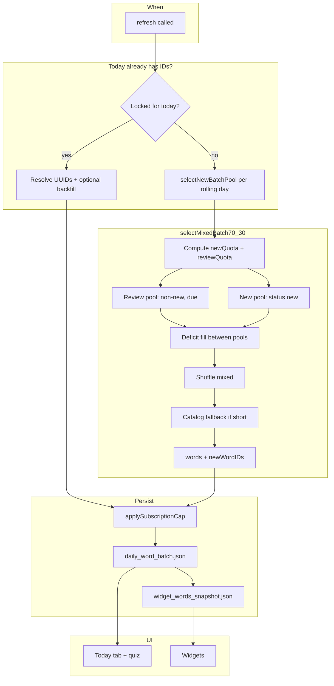

# GlanceSAT — How today’s daily words are selected

| Field | Value |
|-------|--------|
| **Audience** | Engineering, product, support |
| **Source of truth** | `DailyWordBatchService.swift`, `FreemiumLimits.swift` |
| **Related** | `GlanceSAT_SRS_and_Daily_Selection.md` (SRS math), `GlanceSAT_Widget_Daily_Rotation.md` (widget rotation), `GlanceSAT_Widget_Data_and_Timeline.md` (widgets) |
| **Last updated** | June 2026 |

---

## Executive summary

Each **local calendar day**, GlanceSAT picks a fixed list of word IDs (the “daily batch”) and keeps that list until midnight. The same batch powers:

- **Today** tab (carousel + daily quiz)
- **Home / lock screen widgets** (via `widget_words_snapshot.json`)

**Premium:** up to **10** words per day.  
**Freemium:** up to **3** words per day (`FreemiumLimits.effectiveDailyWordCount`).

New batches use a **70% review / 30% new** split (`selectMixedBatch70_30`). The split is computed at selection time; which IDs were chosen as “new” is stored so the Today label stays stable even if SRS updates `status` later in the day.

---

## 1. When selection runs

`DailyWordBatchService.refresh(modelContext:)` is the single entry point. It runs on:

- Cold launch (`AppBootstrap`)
- Today tab sync / scene active
- Timezone change
- Post–primary-quiz snapshot refresh (`flushFutureQueueAndRefresh`)
- Other batch invalidation paths

### Refresh pipeline (order matters)

```text
1. WidgetInteractionReconciler.reconcile()
      → Apply pending widget quiz SRS from App Group queue

2. WidgetDailyState.clearIfNotToday()
      → Clear stale “quiz completed today” flags if the calendar day changed

3. Archive past days from rolling queue → daily_batch_history.json (max 60 entries)

4. Build or load the 4-day rolling queue (today … today+3)
      → See §3 and §4

5. Resolve today’s UUIDs → [Word] in persisted order

6. applySubscriptionCap (3 or 10 words)

7. Persist daily_word_batch.json + dailyNewWordIDs metadata

8. WidgetSnapshotWriter.writeSnapshot → widget_words_snapshot.json

9. WidgetTimelineReloader (debounced)
```

---

## 2. Calendar-day lock (why the 10 don’t change at noon)

Once `daily_word_batch.json` has a non-empty list for `yyyy-MM-dd` (user’s local timezone):

- Same-day `refresh()` **only loads those UUIDs** in order — it does **not** re-run selection because a word became due after a quiz or widget answer.
- Words that move from `"new"` → `"review"` mid-day **stay** in today’s batch until the next local day.

**Exceptions (same day):**

| Case | Behavior |
|------|----------|
| Persisted batch is empty / corrupt / all UUIDs missing from DB | Rebuild today (and rolling days) with `selectNewBatchPool` |
| User upgrades freemium → premium (3 → 10 IDs) | `backfillDueWords` appends more due words **without** removing existing IDs |
| Post–primary quiz | `flushFutureQueueAndRefresh` clears **future** precomputed days and rebuilds the queue; **today’s IDs are rebuilt** as part of full refresh |

---

## 3. Rolling 4-day queue

| Constant | Value |
|----------|--------|
| `maxDailyWords` | 10 |
| `rollingQueueDayCount` | 4 (today, tomorrow, +2, +3) |

**First time today has no batch:** `refresh` builds **four** days at once:

- For each day key `D0…D3`, call `selectNewBatchPool(referenceDate: that day, excluding: all IDs already used in earlier days in the loop)`.
- No word appears in two different days in the same build pass.

**Today already has a batch:** Only **missing future** day keys are filled; today’s list is left as-is (subject to resolve/backfill in §5).

**Post-quiz:** Future keys are removed and recomputed; widgets get fresh forward-looking batches.

---

## 4. Core selector: 70% review / 30% new

**Function:** `selectMixedBatch70_30`  
**Called by:** `selectNewBatchPool` (all new batch builds)

Let `cap` = effective daily count (3 or 10).

### 4.1 Quotas

| Slot | Count | Rule |
|------|-------|------|
| **New** | `max(1, floor(cap × 0.30))` | At least 1 new word when `cap ≥ 1` |
| **Review** | `cap − newQuota` | Remainder |

**Examples (premium, cap = 10):**

- New quota = `max(1, Int(10 × 0.30))` = **3**
- Review quota = **7**

**Examples (freemium, cap = 3):**

- New quota = `max(1, Int(3 × 0.30))` = **1**
- Review quota = **2**

### 4.2 Review pool (≈70% target)

**Predicate:**

```swift
word.status != "new" && word.nextReviewDate <= targetDate
```

- `targetDate` = start of the batch’s calendar day (or that day’s reference date when precomputing tomorrow).
- In practice: words that have been studied at least once (`status` is `learning`, `review`, or `mastered`) and are **due** by that date.

**SQL sort (before shuffle):**

1. `onboardingRank` ascending (lower = boss / priority targets first)
2. `nextReviewDate` ascending (most overdue first)

**Fetch limit:** `max(reviewQuota × 4, reviewQuota)`  
**Shuffle:** `DayKeyedRNG(dayKey + "-review")`  
**Take:** first `reviewQuota` words after shuffle

### 4.3 New pool (≈30% target)

**Predicate:**

```swift
word.status == "new"
```

**SQL sort:** `randomSortHash` ascending (avoids alphabetical bias on device)  
**Fetch limit:** `max(newQuota × 4, newQuota)`  
**Shuffle:** `DayKeyedRNG(dayKey + "-new")`  
**Take:** first `newQuota` words after shuffle

### 4.4 Deficits (either side can borrow)

| Situation | Fill |
|-----------|------|
| Not enough due reviews | Remaining review slots filled from **extra new** words still in the new pool |
| Not enough new words | Remaining new slots filled from **extra reviews** still in the review pool |

### 4.5 Merge and final shuffle

```text
combined = selectedReviews + selectedNew
combined = shuffledDailySelection(combined, dayKey: dayKey + "-mixed")
```

Presentation order (carousel, quiz order before generator logic) follows this **mixed** shuffle — not “all reviews then all news.”

### 4.6 Catalog safety net

If `combined.count < cap` after deficits:

- `selectCatalogFallbackBatch` fills the gap.
- Sort: `frequencyRank` ↑, `difficulty` ↑, `onboardingRank` ↑
- Day-keyed shuffle; **`status == "new"` words are preferred** over already-seen words in the merged list.

### 4.7 Persisted “new” IDs (Today label)

Return type `DailyBatchSelection` includes:

- `words` — final list (≤ `cap`)
- `newWordIDs` — IDs that came from the **new** pool (before mixed shuffle), intersected with final list

Stored in `daily_word_batch.json` as `dailyNewWordIDs[dayKey]`.

**Today header:** `Today's Words · {n} new · {r} review`

- `n` = count of today’s words whose ID is in `dailyNewWordIDs[today]`
- `r` = `displayWords.count − n`
- Legacy batches without metadata get a one-time backfill on next `refresh` (re-run 70/30 inference or ~30% heuristic)

This label is **not** recomputed from live `word.status` every render (SRS can flip status after selection).

---

## 5. Loading today when a batch already exists

If `queue[todayKey]` has IDs:

1. **Resolve** UUIDs → `[Word]` preserving order (`resolveWords`).
2. If resolve returns empty → rebuild all required rolling days (same as no batch).
3. If `resolved.count < cap` (e.g. premium upgrade) → **`backfillDueWords`**:
   - Keep existing IDs
   - Append due words (`nextReviewDate <= today`) with day-keyed shuffle
   - Catalog fallback if still short
4. Apply subscription cap → persist

**Note:** `backfillDueWords` does **not** use the 70/30 split; it only tops up count. Metadata backfill may run separately (`backfillNewWordMetadataIfNeeded`).

---

## 6. Deterministic shuffle (`DayKeyedRNG`)

Same calendar `dayKey` (+ optional suffix `"-review"`, `"-new"`, `"-mixed"`) → same shuffle for the same input pool.

- Seed: FNV-1a style hash of the UTF-8 day key string
- Used for: review pool, new pool, mixed order, catalog fallback, widget slot index stability

Different suffixes → different shuffles for the same day (by design).

---

## 7. What is *not* the daily ten

| Feature | Uses daily batch? |
|---------|-------------------|
| **Primary daily quiz** | Yes — same word IDs as Today |
| **Supplemental “another quiz”** | No — `SupplementalQuizPlanner` + history + due pools |
| **Library browse** | No — full catalog |
| **Widget word index rotation** | Reads snapshot built from batch, but rotation schedule is separate (30‑min slots) |

---

## 8. Onboarding difficulty seeding (legacy code)

`selectSeededNewBatch` / `selectSeededCatalogFallbackBatch` still exist: they pick words in **difficulty bands** from `DiagnosticBaseline` (onboarding calibration).

**As of June 2026 they are not called from `refresh` or `selectNewBatchPool`.** All new batches go through **`selectMixedBatch70_30` only**. If product re-enables baseline seeding, wire it before `selectMixedBatch70_30` on the first batch after onboarding.

---

## 9. End-to-end flow



---

## 10. Quick reference — files

| Concern | File |
|---------|------|
| Selection & refresh | `GlanceSAT/DailyWordBatchService.swift` |
| Premium vs free count | `GlanceSAT/FreemiumLimits.swift` |
| SRS updates to words | `GlanceSAT/SRSEngine.swift` |
| Today counts UI | `GlanceSAT/DailyHubView.swift` |
| Widget snapshot | `GlanceSAT/WidgetSnapshotWriter.swift` |
| Batch persistence | App Group `daily_word_batch.json` |

---

## 11. FAQ

**Why does the header say “3 new · 7 review” but a word shows as review in the library?**  
The header uses **IDs stored at batch creation**, not live `status` after quizzes/widgets.

**Why 10 words in code but I only see 3?**  
Freemium cap is 3; premium is 10.

**Why didn’t a word I missed this morning disappear from today?**  
Calendar-day lock: today’s batch is fixed until midnight.

**Why did my words change after finishing the daily quiz?**  
`flushFutureQueueAndRefresh` rebuilds **future** widget days and may refresh today’s snapshot; primary batch IDs for today are intended to stay unless a full rebuild path runs.
