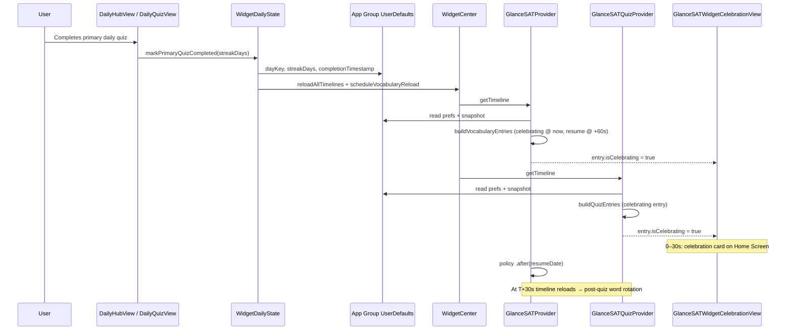

# GlanceSAT — Widget post-quiz celebration

| Field | Value |
|-------|--------|
| **Audience** | Engineering, product |
| **Scope** | Home Screen **Glance** (vocabulary) and **Glance Quiz** widgets |
| **App Group** | `group.com.glance.GlanceSAT` |
| **Last updated** | June 2026 |

---

## 1. What the celebration is

After the user finishes the **primary daily quiz** (not supplemental rounds), both home-screen widgets briefly switch from word/quiz UI to a shared **celebration card**:

- Streak plant image (stage derived from current streak days)
- “Well done!” copy encouraging the user to review today’s words in context
- **No deep link** on the vocabulary widget during celebration (tap does nothing useful)
- Quiz widget still carries a library deep link on the entry, but the celebration view does not surface quiz controls

This is **not** the in-app `DailyQuizMasteryCelebrationView` (full-screen word recap inside the quiz flow). Widget celebration is a separate, **30-second** surface driven by App Group prefs.

---

## 2. When celebration starts (host app → App Group)

### 2.1 Trigger

Celebration is **sent** when the primary daily quiz completes successfully inside the app:

| Step | Location | What happens |
|------|----------|----------------|
| 1 | `DailyHubView` → `DailyQuizView` completion handler | User finishes primary quiz; supplemental rounds return early and **do not** mark completion |
| 2 | `WidgetDailyState.markPrimaryQuizCompleted(streakDays:)` | Writes three App Group keys and requests widget reload |

```swift
// WidgetDailyState.swift
defaults.set(dayKey, forKey: "widget.primaryQuizCompletedDayKey")
defaults.set(streakDays, forKey: "widget.streakDays")
defaults.set(Date().timeIntervalSince1970, forKey: "widget.lastQuizCompletionTimestamp")
WidgetCenter.shared.reloadAllTimelines()
WidgetTimelineReloader.scheduleVocabularyReload()  // vocab + quiz kinds, ~0.4s debounce
```

### 2.2 App Group keys

| Key | Type | Purpose |
|-----|------|---------|
| `widget.primaryQuizCompletedDayKey` | `String` (`yyyy-MM-dd`) | Primary quiz done for this local calendar day |
| `widget.streakDays` | `Int` | Streak count shown on celebration plant |
| `widget.lastQuizCompletionTimestamp` | `Double` (Unix seconds) | **Start** of the 30s celebration window |

### 2.3 What does **not** send celebration

| Event | Celebration? |
|-------|----------------|
| Supplemental / “Take another quiz” round | No |
| Debug “Preview mastery celebration” (in-app full-screen) | No — does not write widget prefs |
| App relaunch after quiz already done | No new timestamp — existing timestamp from original completion is reused |
| Midnight rollover | Keys cleared by `WidgetDailyState.clearIfNotToday` during batch refresh; celebration cannot span days |

---

## 3. Celebration window (timing)

Defined in `WidgetTimelineBuilder.celebrationDuration` = **30 seconds**.

A widget is “actively celebrating” when **all** of the following are true:

1. `widget.lastQuizCompletionTimestamp` exists and is &gt; 0
2. Completion date is **today** in the widget’s local calendar (`calendar.isDateInToday(completion)`)
3. `now - completion < 30s`

**Display rule:** Celebration UI is gated on `WidgetPrefsReader.isInQuizCelebrationWindow()` at render time, not on stale timeline `isCelebrating` flags. Timeline entries still schedule transitions, but the widget will stop showing celebration as soon as the prefs window ends even if WidgetKit has not reloaded yet.

```swift
// WidgetPrefsReader.swift
static func isInQuizCelebrationWindow(now: Date = Date(), calendar: Calendar = .current) -> Bool {
    guard let completion = lastQuizCompletionTimestamp(),
          calendar.isDateInToday(completion) else { return false }
    return now.timeIntervalSince(completion) < WidgetTimelineBuilder.celebrationDuration
}
```

### Timeline (single completion)

```text
T+0s     Primary quiz completes in app
         └─ markPrimaryQuizCompleted writes timestamp + reloads widgets

T+0–30s  CELEBRATION WINDOW
         └─ Both widgets show GlanceSATWidgetCelebrationView

T+30s    Celebration ends (resumeDate = completion + 30s)
         └─ Widgets return to normal half-hour word rotation
         └─ Entries carry isPostQuizCompletedDay = true (hook/example actions disabled)

Rest of day   Normal rotation, post-quiz mode
Midnight      primaryQuizCompletedDayKey cleared if day key ≠ today
```

---

## 4. How celebration is scheduled (timeline providers)

Both widgets read the same snapshot and prefs; celebration injection lives mainly in `WidgetTimelineBuilder` and each provider.

### 4.1 Vocabulary widget (`GlanceSATProvider`)

**File:** `GlanceSATVocabularyWidget.swift`

On `getTimeline`:

1. Load snapshot → today’s visible words
2. `WidgetTimelineBuilder.buildVocabularyEntries(now:words:)`:
   - If `activeCelebrationPlan(now:)` is non-nil:
     - Append entry at **`now`** with `isCelebrating: true`
     - Append entry at **`completion + 30s`** with `isPostQuizCompletedDay: true`
     - Append remaining :00/:30 slots for rest of day (post-quiz)
3. `entriesEnsuringCelebration(...)` — safety net: if prefs say we’re in-window but no active entry has `isCelebrating`, inject one at `now`
4. **Reload policy:** `.after(resumeDate)` when celebration active (so the widget wakes at T+30s without waiting for end-of-day); otherwise `.atEnd`
5. **Host follow-up:** `WidgetDailyState.schedulePostCelebrationWidgetReload()` reloads all timelines ~30.5s after completion if WidgetKit does not advance on its own

**Snapshot path (`getSnapshot` / `entry(for:)`):** if `isInQuizCelebrationWindow`, returns a single celebrating entry anchored at the completion timestamp.

### 4.2 Quiz widget (`GlanceSATQuizProvider`)

**File:** `GlanceSATQuizWidget.swift`

On `getTimeline`:

1. If user just answered in-widget (`activeFeedbackTimeline`), that **short-circuits** the timeline — celebration is skipped until feedback hold ends
2. Otherwise `buildQuizEntries(...)`:
   - If `celebrationPlan(now:)` is non-nil:
     - Celebrating entry at `plan.completionDate`, `displayPhase: .vocab`, `isCelebrating: true`
     - Resume entry at `plan.resumeDate` (completion + 30s)
     - Remaining half-hour slots through 23:30
3. Uses same `vocabularyTimelinePolicy` → `.after(resumeDate)` during celebration

**Important:** `activeFeedbackTimeline` explicitly bails out when `celebrationPlan != nil` or `isPostQuizDisplayDay` — in-widget quiz feedback and celebration do not overlap.

---

## 5. How celebration is displayed (view layer)

Both root views use the same dual-source check so stale timeline entries still celebrate if prefs are fresh:

```swift
private var isActivelyCelebrating: Bool {
    WidgetPrefsReader.isInQuizCelebrationWindow()  // prefs only; ignore stale entry.isCelebrating
}
```

| Widget | Root view | Celebration branch |
|--------|-----------|-------------------|
| Glance (vocab) | `GlanceSATWidgetRootView` | → `GlanceSATWidgetCelebrationView` |
| Glance Quiz | `GlanceSATQuizWidgetRootView` | → same `GlanceSATWidgetCelebrationView` |

**View priority order (both widgets):**

1. Stale snapshot → “Updating today’s words…”
2. **Celebrating** → `GlanceSATWidgetCelebrationView`
3. Freemium lock (vocab only) → paywall UI — **suppressed during celebration window**
4. Resting (`isResting`) → `GlanceSATWidgetRestView` — **preview only; production timelines never set `isResting: true`**
5. Normal word / quiz UI

### 5.1 Celebration UI copy (Home Screen families)

| Family | Plant | Message |
|--------|-------|---------|
| **Small** | Streak-stage asset | “Well done! / See today's words.” |
| **Medium / Large** | Streak-stage asset | “Well done on completing today's recall! / Time to see today's words in context.” |

Lock Screen accessory families show shortened text (“Quiz complete”, “Well done! / Today's recall is complete.”) with the same plant asset on circular/rectangular layouts.

Plant stage: `WidgetStreakPlantStage(days: streakDays)` — falls back to `WidgetPrefsReader.streakDays()` if the entry carries 0.

---

## 6. End-to-end flow (diagram)



---

## 7. Post-celebration behavior (same day)

After 30 seconds, widgets **do not** show `GlanceSATWidgetRestView` in production. Instead:

- Normal **half-hour word rotation** continues through end of local day
- `isPostQuizCompletedDay: true` on entries → hook/example reveal actions disabled on word cards
- `widget.primaryQuizCompletedDayKey` remains set until midnight clear

`WidgetTimelineBuilder.isPostQuizDisplayDay` returns:

- `false` during the 30s celebration window
- `true` after celebration if completion was today **or** primary-quiz-done flag is set for today

---

## 8. Reload and edge cases

| Scenario | Behavior |
|----------|----------|
| Widget reload delayed | `isInQuizCelebrationWindow()` at **render time** still shows celebration if prefs are in-window |
| Timeline built before quiz, prefs updated after | `entriesEnsuringCelebration` (vocab) patches celebrating entry; quiz relies on reload from `markPrimaryQuizCompleted` |
| User completes quiz with app backgrounded | Timestamp written immediately; widgets reload on next timeline refresh |
| Freemium daily limit reached | Vocab widget would show lock UI, **except** during celebration window (`shouldShowFreemiumLock` returns false while celebrating) |
| Supplemental quiz only | No new timestamp; widgets stay in pre-quiz or post-quiz state |

---

## 9. Implementation index

| Topic | File |
|-------|------|
| Write completion + timestamp | `WidgetDailyState.swift` |
| Quiz completion callsite | `DailyHubView.swift` (`DailyQuizView` completion handler) |
| Read prefs / window check | `WidgetPrefsReader.swift` |
| Celebration duration + plan | `WidgetTimelineBuilder.swift` |
| Vocab timeline + safety net | `GlanceSATVocabularyWidget.swift` |
| Quiz timeline | `GlanceSATQuizWidget.swift` |
| Celebration UI | `GlanceSATWidgetViews.swift` → `GlanceSATWidgetCelebrationView` |
| Vocab root routing | `GlanceSATWidgetViews.swift` → `GlanceSATWidgetRootView` |
| Quiz root routing | `GlanceSATQuizWidgetViews.swift` → `GlanceSATQuizWidgetRootView` |
| Debounced reload | `WidgetTimelineReloader.swift` |
| Related timeline docs | [GlanceSAT_Widget_Data_and_Timeline.md](GlanceSAT_Widget_Data_and_Timeline.md), [GlanceSAT_Widget_Daily_Rotation.md](GlanceSAT_Widget_Daily_Rotation.md) |
