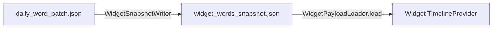
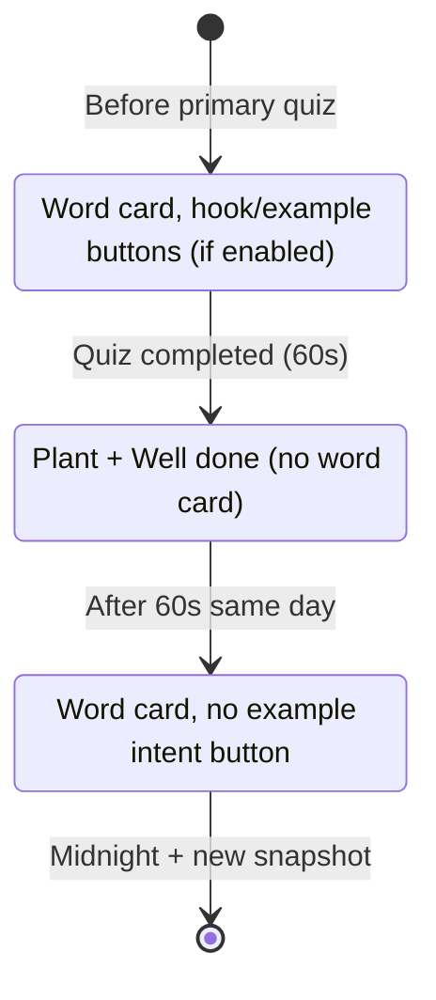

# GlanceSAT — How the daily words rotate on widgets

| Field | Value |
|-------|--------|
| **Audience** | Engineering, product, support |
| **Source of truth** | `WidgetTimelineBuilder.swift`, `WidgetSlotClock.swift`, `GlanceSATVocabularyWidget.swift`, `GlanceSATQuizWidget.swift` |
| **Related** | [GlanceSAT_Todays_10_Daily_Words.md](GlanceSAT_Todays_10_Daily_Words.md) (how the 10 are chosen), [GlanceSAT_Widget_Data_and_Timeline.md](GlanceSAT_Widget_Data_and_Timeline.md) (snapshot + reload triggers) |
| **Last updated** | June 2026 |

---

## Executive summary

Widgets do **not** pick words from SwiftData at display time. They read **`widget_words_snapshot.json`** in the App Group, take **today’s** word array (`dailyBatches["yyyy-MM-dd"]`), optionally hide dismissed IDs, then map **clock time → slot index → word index** with modular arithmetic.

- **When the headword changes:** only at scheduled **timeline entry dates** (every **30 minutes** on the `:00` / `:30` grid, plus special entries after quiz completion).
- **How many slots per day:** **48** (`24h × 2`).
- **Premium word count:** up to **10** in the snapshot (freemium: **3**).
- **Vocabulary widget** and **quiz widget** use the **same** daily list but **different indices** in each slot (quiz is offset by +1).

There is **no random per refresh** in the extension: the same local day + same time always maps to the same word (deterministic).

---

## 1. Where the word list comes from



| Step | What happens |
|------|----------------|
| Host `DailyWordBatchService.refresh` | Builds/locks today’s UUIDs (see daily-words doc) |
| `WidgetSnapshotWriter.writeSnapshot` | Writes **up to 4 days** of batches: `dailyBatches[dayKey] → [WidgetWordSnapshot]` |
| Widget `getTimeline` | `todayKey = WidgetCalendar.dayKey(for: now)` → `payload.words(forDayKey: todayKey)` |
| Filter | `WidgetInteractionStore.visibleWords` removes `widget.interactions.dismissedWordIDs` (if all dismissed, uses full list) |

**Order of the array:** Same order as persisted in today’s batch (post–70/30 mixed shuffle at selection time). Widget rotation uses **array index**, not alphabetical headword.

**Freemium:** Snapshot contains **3** words for today; rotation uses `wordCount = 3` (same formulas, shorter cycle).

---

## 2. The 30-minute grid (48 slots)

| Constant | Value |
|----------|--------|
| `rotationIntervalMinutes` | **30** |
| `timelineSlotsPerDay` | **48** |

### 2.1 Slot index (0…47)

Minutes since local midnight, divided by 30:

```text
slotIndex = min(floor(minutesSinceMidnight / 30), 47)
```

| Local time | Minutes since midnight | Slot index |
|------------|------------------------|------------|
| 12:00 AM | 0 | 0 |
| 12:30 AM | 30 | 1 |
| 1:00 AM | 60 | 2 |
| … | … | … |
| 11:30 PM | 1410 | 47 |

**Slot key** (quiz widget state): `"yyyy-MM-dd_{slotIndex}"` e.g. `2026-06-02_14`.

### 2.2 Timeline entry dates

`remainingHalfHourSlotDates(from: now)` builds every remaining **:00** and **:30** from the current half-hour floor through **23:30** today.

- If `now` is **2:17 PM**, the next entry might be **2:30 PM**, then **3:00 PM**, … **11:30 PM**.
- An extra entry at **`now`** is inserted when needed so the widget can show the current word immediately after reload.

WidgetKit displays the entry with the **latest `date` ≤ current time**. When the clock passes the next entry’s `date`, the UI advances to that word.

**Policy:**

- Normal: `TimelineReloadPolicy.atEnd` (reload when the **last** scheduled entry time passes — typically end of today’s schedule).
- During post-quiz celebration window: `.after(resumeDate)` where `resumeDate = completion + 60s` so rotation resumes without waiting until midnight.

---

## 3. Which word shows in each slot (vocabulary widget)

### 3.1 Formula

For `wordCount = N` (3 or 10):

```text
slot = (hour * 2) + (minute >= 30 ? 1 : 0)
wordIndex = slot % N
displayedWord = words[wordIndex]
```

Implemented as `WidgetTimelineBuilder.wordIndex(for:date, wordCount:)`.

### 3.2 Example — 10 words (premium)

Label today’s batch indices `W0…W9` in snapshot order.

| Local time | `slot` | `slot % 10` | Word shown |
|------------|--------|-------------|------------|
| 12:00 AM | 0 | 0 | W0 |
| 12:30 AM | 1 | 1 | W1 |
| 1:00 AM | 2 | 2 | W2 |
| … | … | … | … |
| 4:30 AM | 9 | 9 | W9 |
| 5:00 AM | 10 | 0 | W0 (cycle repeats) |
| 5:30 AM | 11 | 1 | W1 |
| Noon | 24 | 4 | W4 |
| 11:30 PM | 47 | 7 | W7 |

**Full day:** 48 slot transitions → each of the 10 words appears on **4 or 5** half-hour periods (`⌈48/10⌉`).

### 3.3 Example — 3 words (freemium)

| Local time | `slot % 3` |
|------------|------------|
| 12:00 AM | W0 |
| 12:30 AM | W1 |
| 1:00 AM | W2 |
| 1:30 AM | W0 |
| … | cycles every 1.5 hours |

---

## 4. Quiz widget — different word, same clock

The quiz widget uses the **same** `words[]` array but **`quizWordIndex = (vocabIndex + 1) % N`**.

| Vocab index at slot | Quiz index (N=10) |
|-------------------|-------------------|
| 0 | 1 |
| 9 | 0 |
| 4 | 5 |

So at **12:00 AM**, if Glance shows **W0**, Glance Quiz shows **W1** (when in vocab/quiz phase).

### 4.1 Quiz-only phases (same slot, same word)

Per `slotKey` + `wordID`, `WidgetQuizSlotStore` can override the timeline phase:

| Phase | UI |
|-------|-----|
| `.quiz` | Sentence prompt + answer buttons |
| `.feedback` | Result state (~1.2s correct / ~3s incorrect) |
| `.vocab` | Same card as vocabulary widget |

**In-widget answer:** Timeline may collapse to **two entries** — `now` (feedback) + `now + 3s` (vocab) — then normal half-hour rotation resumes.

Words **without** sentence quiz data always use `.vocab` for that slot.

---

## 5. What changes throughout the day (modes)

The **word index math stays the same** in rotation slots; **UI mode** can override content.



| Mode | When | Word rotation? | UI |
|------|------|----------------|-----|
| **Normal** | Primary quiz not done today | Yes | Full word card |
| **Celebration** | ≤ **60s** after `widget.lastQuizCompletionTimestamp` | Paused on celebration entry | `GlanceSATWidgetCelebrationView` |
| **Post-quiz** | After celebration, or `widget.primaryQuizCompletedDayKey == today` | Yes | Word card; `isPostQuizCompletedDay` hides example button |
| **Freemium lock** | Quiz done + not premium + limit flag | No | Paywall tile |
| **Stale snapshot** | No batch for widget’s local today | No | “Open GlanceSAT to refresh” |

**Freemium lock vs celebration:** Vocabulary widget skips the paywall lock during the 60s celebration window so both home widgets can show “Well done.”

**Live prefs:** Vocabulary root view also checks `WidgetPrefsReader.isInQuizCelebrationWindow()` so celebration can appear even if the timeline entry lagged.

---

## 6. Building today’s timeline (vocabulary)

**File:** `GlanceSATProvider.getTimeline` → `WidgetTimelineBuilder.buildVocabularyEntries`

1. Load `words` = visible today snapshots.
2. If celebrating → entry at **`now`** (`isCelebrating: true`) + entry at **`completion + 60s`** + half-hour slots from resume (post-quiz flags).
3. Else if post-quiz day → half-hour slots from **`now`** with `isPostQuizCompletedDay: true`.
4. Else → half-hour slots from **`now`** (normal).
5. `finalizeVocabularyEntries` → sort by date, dedupe entries within 0.5s.
6. `entriesEnsuringCelebration` safety net if prefs say celebrating but builder missed it.

Each rotation entry sets:

```swift
GlanceSATEntry(
  date: slotDate,
  word: word(at: slotDate, in: words),
  isPostQuizCompletedDay: ...
)
```

---

## 7. What does *not* rotate the words

| Action | Effect on widget word |
|--------|------------------------|
| Opening the app | May reload timeline; **same** mapping if same day/time |
| Revealing example/hook on widget | Same word; toggles UI only |
| Answering quiz on widget | Short feedback timeline; same slot’s word |
| SRS / quiz in app updating `status` | Does **not** change today’s batch IDs or slot index |
| Midnight (widget alone) | Shows **stale** until host writes new snapshot for new `dayKey` |

Tomorrow’s words are **precomputed** in the snapshot (`today+1…+3`) but widgets only **read today’s key** until the calendar day changes and the host refreshes.

---

## 8. Midnight and timezone

| Event | Widget behavior |
|-------|-----------------|
| Local date → new day, old snapshot | `wordsForDay(todayKey)` missing → **stale** UI |
| Host `refresh` after launch / active | New `dailyBatches[newToday]` written → new rotation cycle |
| User changes timezone | Host refresh; new `todayKey` and slot grid |

The extension does **not** schedule entries for tomorrow; it only schedules through **23:30** of the **current** local day when the timeline was built.

---

## 9. Reload triggers (when the schedule rebuilds)

| Trigger | Result |
|---------|--------|
| `WidgetTimelineReloader` after batch/snapshot write | Recompute all half-hour entries from **current** `now` |
| Timeline `.atEnd` / `.after(resume)` | System calls `getTimeline` again |
| Widget intents (example toggle, quiz answer) | Quiz: short feedback timeline; vocab: reload |
| `WidgetCenter.reloadAllTimelines()` | Full rebuild |

After reload at **2:17 PM**, the builder creates entries from **2:30 PM** onward (not re-scheduling 12:00 AM slots that already passed).

---

## 10. Quick reference — implementation map

| Concern | Location |
|---------|----------|
| Slot → word index | `WidgetTimelineBuilder.wordIndex` |
| Quiz offset | `WidgetSlotClock.quizWordIndex` |
| Half-hour dates | `WidgetTimelineBuilder.remainingHalfHourSlotDates` |
| Vocab timeline | `WidgetTimelineBuilder.buildVocabularyEntries` |
| Quiz timeline | `GlanceSATQuizProvider.buildQuizEntries` |
| Today’s word array | `WidgetSnapshotPayload.words(forDayKey:)` |
| Dismiss filter | `WidgetInteractionStore.visibleWords` |
| Constants | `GlanceSATWidgetConstants` |

---

## 11. FAQ

**Why did my widget show the same word for two hours?**  
Two consecutive 30-minute slots can map to the same index when `slot % N` repeats (e.g. with 10 words, slots 10 and 20 both → index 0). With 10 words you get a change most half-hours; with 3 words you repeat every 1.5 hours.

**Why doesn’t the widget match Today’s carousel order?**  
Today UI uses the batch list order for scrolling; widgets use **time → index**. Order in the array still matters for *which* word is `W0`, `W1`, etc.

**Why do Glance and Glance Quiz differ at the same time?**  
By design: quiz index is **vocab index + 1** (mod N).

**I finished the quiz — why did rotation stop briefly?**  
60-second **celebration** entry; then post-quiz rotation continues.

**Why 48 slots but only 10 words?**  
48 is the clock grid; **10** is how many distinct words cycle via `% 10`.
