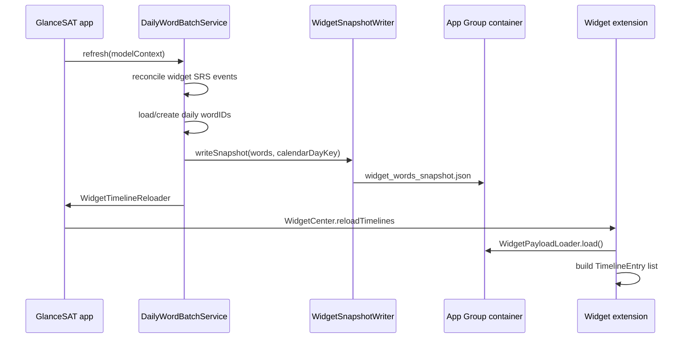

# GlanceSAT — Widget data & timelines

| Field | Value |
|-------|--------|
| **Audience** | Engineering, product |
| **Extensions** | `GlanceSATWidgets` target |
| **App Group** | `group.com.glance.GlanceSAT` |
| **Last updated** | May 2026 |

---

## 1. How widgets get vocabulary data

### 1.1 Pipeline (host app → extension)

1. **`DailyWordBatchService.refresh`** selects or resolves today’s batch, applies freemium cap, persists `daily_word_batch.json`.
2. **`WidgetSnapshotWriter.writeSnapshot`** maps each `Word` → `WidgetWordSnapshot` (adds sentence-quiz fields via `WidgetSentenceQuizBuilder`), encodes **`WidgetSnapshotPayload`**, writes atomically under App Group lock.
3. **`WidgetTimelineReloader`** debounces reload (~0.4 s) for vocabulary + quiz kinds.
4. Widget **`TimelineProvider.getTimeline`** reads JSON via **`WidgetPayloadLoader.load()`** (in-memory cache keyed on file modification date).

### 1.2 Snapshot file

| Property | Value |
|----------|--------|
| **Path** | `{App Group}/widget_words_snapshot.json` |
| **Schema** | `WidgetSnapshotPayload` — `updatedAt`, `calendarDayKey` (`yyyy-MM-dd`), `words[]` |
| **Word fields** | `id`, `word`, `partOfSpeech` (abbreviated), `definition`, `exampleSentence`, `etymology`, `memoryHookText`, `sentenceQuizPrompt`, `synonymQuizOptions`, `synonymQuizCorrectAnswer` |
| **Placeholder** | `WidgetWordSnapshot.placeholder` — “Glance” / “Open the app to sync…” when empty or loading |

### 1.3 Other App Group inputs widgets read

| Key / file | Purpose |
|------------|---------|
| `widget.prefs.*` | Style, theme, typography |
| `widget.primaryQuizCompletedDayKey` | Primary quiz done today → post-quiz UI |
| `widget.streakDays` | Streak count on celebration/rest |
| `widget.lastQuizCompletionTimestamp` | 5-minute celebration window |
| `widget.subscription.hasPremium` / `freemiumLimitReached` | Paywall lock state |
| `satExamDateSeconds` | SAT countdown widget |
| `widget.interactions.dismissedWordIDs` | Words hidden after interaction (legacy dismiss) |
| `widget.interactions.revealedExampleWordIDs` / `revealedDetailWordIDs` | Hook vs example reveal |
| `WidgetQuizSlotStore` (UserDefaults) | Per-slot quiz phase / feedback |

Widgets **do not** open SwiftData. If `payload.calendarDayKey != widget’s local today`, they show **stale** UI and request reload at timeline end.

---

## 2. Widget kinds

| Widget | Kind ID | Families | Data source |
|--------|---------|----------|-------------|
| **Glance** (vocabulary) | `com.mikihill.GlanceSAT.vocabulary` | Small, Medium, Large, Lock inline/rect/circular | Daily batch snapshot |
| **Glance Quiz** | `com.mikihill.GlanceSAT.quiz` | Medium, Large | Same snapshot + quiz fields |
| **SAT Countdown** | `com.mikihill.GlanceSAT.countdown` | Small, Medium, Large | `satExamDateSeconds` in App Group prefs only |

Gallery copy:

- Glance: “SAT vocabulary on your Home Screen and Lock Screen.”
- Glance Quiz: “Sentence-completion quizzes on your Home Screen, then the word card.”
- SAT Countdown: “Days until your SAT — set your test date in Glance settings.”

---

## 3. Vocabulary widget timeline

**Files:** `GlanceSATVocabularyWidget.swift`, `WidgetTimelineBuilder.swift`

### 3.1 Policy

- **`Timeline(entries:policy: .atEnd)`** — system reloads when the **last entry’s date** passes.
- Timeline is built **only through the end of the current local calendar day**, not multiple days ahead.

### 3.2 How far ahead?

| Mode | Entries | Horizon |
|------|---------|---------|
| **Normal rotation** | One entry per remaining **:00** and **:30** slot from `now` through **23:30** local | Rest of **today only** |
| **Celebration** (≤ 5 min after primary quiz completion timestamp) | `now` (celebrating) + `completion + 5 min` + slots from resume time | Through end of today |
| **Post-quiz day** (after celebration or flag set) | Same half-hour slots; words still rotate; **no** hook/example actions (`isPostQuizCompletedDay`) | Through end of today |
| **Stale snapshot** | Single entry at `now` | Reload at `.atEnd` (host should refresh) |
| **Freemium daily limit** | Single locked entry | Reload at `.atEnd` |

**Slot math:**

- `rotationIntervalMinutes = 30` → **48 slots per day** (`timelineSlotsPerDay`).
- Word index: `((hour * 2) + (minute >= 30 ? 1 : 0)) % wordCount` cycling the **visible** daily words (after dismiss filter).

**Not scheduled in extension:** midnight rollover or tomorrow’s batch — that requires host `refresh` + new snapshot.

### 3.3 Visible words

`WidgetInteractionStore.visibleWords` filters `dismissedWordIDs` from the snapshot list. If all dismissed, falls back to full list.

### 3.4 Deep links

- Word card → `glancesat://library/word/{uuid}`
- Paywall lock → `glancesat://paywall`

---

## 4. Quiz widget timeline

**Files:** `GlanceSATQuizWidget.swift`, `GlanceSATQuizWidgetViews.swift`

### 4.1 Horizon

Same as vocabulary: **remaining half-hour slots today**, `.atEnd` policy.

### 4.2 Phases per entry

| Phase | UI |
|-------|-----|
| `.quiz` | Sentence prompt + tap options (`AnswerWidgetQuizIntent`) |
| `.feedback` | ~3 s hold after answer, then handoff to vocab card |
| `.vocab` | Same home card as vocabulary widget |

**Quiz word selection:** `WidgetTimelineBuilder.quizWord` uses a **different index** than vocab (`WidgetSlotClock.quizWordIndex`) so quiz and vocab widgets can show different headwords in the same 30-minute slot.

### 4.3 Active feedback shortcut

If user just answered in-widget, timeline may collapse to **two entries** (`now` feedback + `now+3s` vocab) before resuming rotation.

### 4.4 Post-quiz / celebration

Mirrors vocabulary builder: celebration entries, then post-quiz rotation with `isPostQuizCompletedDay`. Quiz widget can show **`GlanceSATWidgetRestView`** when entry has `isResting` (preview path; production timelines use post-quiz vocab with actions disabled).

---

## 5. SAT Countdown widget timeline

**File:** `GlanceSATCountdownWidget.swift`

| State | UI |
|-------|-----|
| Date set | Large day count + “days to go” / “day to go” + “until the SAT” |
| Past date | “Past” + “Update your SAT date in settings” |
| No date | “Set your SAT date” + “Open Glance settings to activate this countdown.” |

**Timeline:** Single entry for `now`, **`policy: .after(next midnight)`** — refreshes once per local day. Tap → `glancesat://settings`.

Data: `WidgetPrefsReader.satExamDateSeconds` / `daysUntilSAT()` (App Group + standard defaults migrated on launch).

---

## 6. When timelines reload

| Trigger | Mechanism |
|---------|-----------|
| Batch refresh / snapshot write | `WidgetTimelineReloader.scheduleVocabularyReload()` |
| Calendar day change | `scheduleAllWidgetReload()` |
| Widget intents (example/hook toggle, quiz answer) | `WidgetIntentReload` immediate |
| Timeline `.atEnd` | System wakes provider again |
| App `scenePhase == .active` | Host `refreshWidgetDataFromHost` → batch refresh |
| Timezone change | Same host refresh |
| SAT date saved | `WidgetCenter.reloadAllTimelines()` in `SATExamDateStore.save` |

---

## 7. Stale & locked behavior

### Stale snapshot

Shown when `widget_words_snapshot.json` `calendarDayKey` ≠ widget local today:

- “Updating today's words…” / “Open the app to refresh.”
- Lock screen: “Updating…”

### Freemium limit

When `widget.subscription.freemiumLimitReached` and not premium:

- “Daily limit reached.” / “Tap to unlock more.”
- Deep link to paywall.

---

## 8. Implementation index

| Topic | File |
|-------|------|
| Snapshot write | `WidgetSnapshotWriter.swift`, `WidgetSnapshotPayload.swift` |
| Snapshot read | `GlanceSATWidgets/WidgetPayload.swift` |
| Vocabulary timeline | `GlanceSATVocabularyWidget.swift`, `WidgetTimelineBuilder.swift` |
| Quiz timeline | `GlanceSATQuizWidget.swift` |
| Countdown | `GlanceSATCountdownWidget.swift` |
| Slot clock | `WidgetSlotClock.swift` |
| Prefs | `WidgetPrefsReader.swift` |
| Reload debounce | `WidgetTimelineReloader.swift` (host) |
| Constants | `GlanceSATWidgetConstants` in `GlanceSATVocabularyWidget.swift` |
