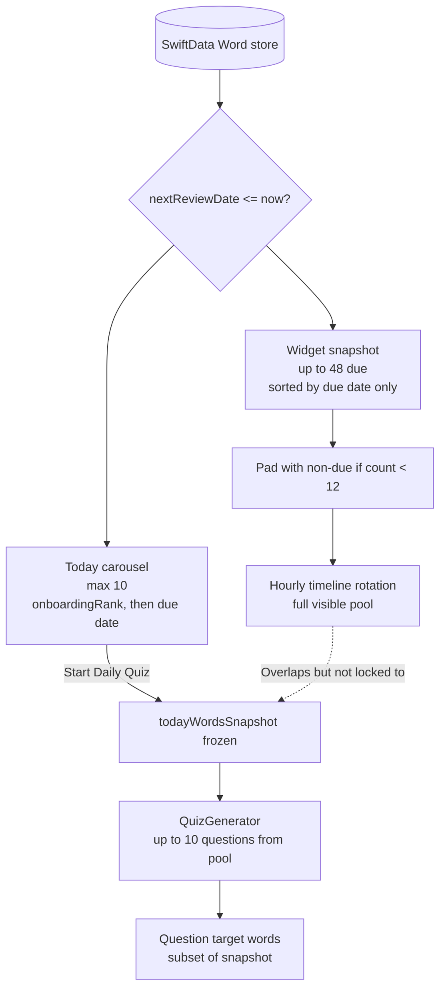

# GlanceSAT — Word Selection Reference

**Document type:** Product / engineering specification  
**Status:** Reflects the Swift implementation as of May 2026  
**Audience:** Engineering, pedagogy, and product review  
**Related:** [GlanceSAT_Algorithms_Reference.md](./GlanceSAT_Algorithms_Reference.md) (SRS, distractors, analytics)

---

## 1. Purpose

This document specifies **how vocabulary rows are chosen** for three learner-facing surfaces:

| Surface | Location | Role |
|---------|----------|------|
| **Today carousel** | `DailyHubView` | Pre- and post-quiz word cards on the Today tab |
| **Daily quiz** | `QuizGenerator` + `DailyQuizView` | Active retrieval practice |
| **Home / Lock Screen widget** | `WidgetSnapshotWriter` + `GlanceSATVocabularyWidget` | Passive exposure between sessions |

All three draw from the same **SwiftData `Word`** store, but they use **different caps, sort keys, and lifecycle rules**. They are **aligned in theme** (due vocabulary first) but **not identical lists**.

---

## 2. Shared concepts

### 2.1 Definition of “due”

A word is **due** when:

```text
word.nextReviewDate <= referenceDate
```

- **Today tab & quiz:** `referenceDate` is `dueAsOf` on `DailyHubView`, defaulting to **now** at view construction.
- **Widget snapshot:** `referenceDate` is **now** at each `WidgetSnapshotWriter.refresh` call.

Due dates are produced by `SRSEngine` after quiz answers, widget interactions, and import seeding. There is no separate scheduling queue beyond SRS state on each row.

### 2.2 Relevant `Word` fields

| Field | Used by |
|-------|---------|
| `nextReviewDate` | Due predicate (all surfaces) |
| `onboardingRank` | Today carousel & quiz fetch ordering only |
| `tonalFoilId` | Connotation-foil quiz slot only |
| `exampleSentence` | Sentence-completion eligibility |
| `status`, `totalAttempts`, `successfulRecalls`, `lastReviewDate` | `hasPriorExposure` (foil gating) |
| SRS counters (`successfulRecalls`, `consecutiveCorrect`, `interval`, `status`) | `sentenceScore` ranking |

### 2.3 `hasPriorExposure`

```swift
status != "new" || totalAttempts > 0 || successfulRecalls > 0 || lastReviewDate != nil
```

Used only when selecting a **connotation-foil** target: non-onboarding foil pairs require the foil word to have prior exposure so the contrast is fair.

---

## 3. High-level relationship



**Key takeaway:** The **carousel and primary daily quiz share the same ten-word batch** once a quiz session starts. The **widget uses a larger, differently sorted pool** and is not limited to those ten.

---

## 4. Today carousel

**Implementation:** `DailyHubView.swift` — `displayWords`, `@Query dueWords`, `todayWordsSnapshot`

### 4.1 Selection rules

| Phase | Source | Cap | Sort order |
|-------|--------|-----|------------|
| **Before first quiz start today** | `dueWords` query | **10** (`prefix(10)`) | 1. `onboardingRank` ascending (nil ranks last) 2. `nextReviewDate` ascending |
| **After quiz start or resume** | `todayWordsSnapshot` | **10** (fixed) | Order at freeze time (see §4.2) |
| **Post-quiz display** | Same snapshot | **10** | Unchanged; cards show remembered / missed / sealed state |

The standing `@Query` and the on-demand `FetchDescriptor` in `startDailyQuiz()` use the **same predicate and sort** (`dueWordSortDescriptors`).

### 4.2 Snapshot freeze (`todayWordsSnapshot`)

When the learner starts the **primary daily quiz**:

1. The app fetches up to **10** due words (with retry loop, then first-launch fallback to any 10 words if still empty).
2. It assigns `todayWordsSnapshot = due`.
3. `displayWords` prefers the snapshot over the live query until the hub is torn down.

**On resume** from `DailyQuizPersistence`, the snapshot is rebuilt as **unique target words in quiz-question order** (`wordsInQuizOrder`), not necessarily the original due-date order.

### 4.3 Carousel vs live due list

Before a quiz starts, the carousel tracks the live due query. After a quiz starts, **SRS updates during the quiz do not reshuffle the carousel** — the visible ten stay fixed for that Today session.

---

## 5. Daily quiz — word pool and questions

**Implementation:** `DailyHubView.startDailyQuiz`, `QuizGenerator.generateQuiz`, `DailyQuizView`

### 5.1 Word pool (input to `generateQuiz`)

| Quiz type | Input words | Cap |
|-----------|-------------|-----|
| **Primary daily** | Same fetch as carousel freeze: due (or fallback any) | **10** (`prefix(10)` inside generator) |
| **Supplemental** (“Take another quiz”) | `displayWords` filtered to **missed** words from the completed primary quiz | **≤ 10** (only misses) |

The supplemental round does **not** re-query the global due list; it only quizzes words the learner missed in the primary round.

### 5.2 Question count and target words

The generator receives the pool above and returns **up to ten `QuizQuestion` values**. Each question has exactly one **`targetWord`** drawn from that pool.

**Important:** The number of questions is **not guaranteed** to equal the number of pool words. A word may appear on the carousel but receive **no question** if modality caps leave it unassigned (see §5.3).

### 5.3 Modality mix (assignment from pool → questions)

Target pacing when the pool has ten words: **6 synonym + 3 sentence + 1 connotation foil** (when eligible).

| Step | Type | Max count | Word removed from pool? | Eligibility |
|------|------|-----------|------------------------|-------------|
| 1 | **Connotation foil** | **1** | Yes | Target has `tonalFoilId`; foil row exists; foil has `hasPriorExposure` **or** target has `onboardingRank` (rigged onboarding) |
| 2 | **Sentence completion** | **3** (or fewer if pool smaller) | No (tracked separately) | Non-empty `exampleSentence`; ranked by `sentenceScore` (highest first) |
| 3 | **Synonym match** | **6** if foil present, else **remainder** | No | Remaining words not used for sentence slots |

**`sentenceScore`** (higher = preferred for sentence items):

```text
(successfulRecalls × 12) + (consecutiveCorrect × 8) + (interval × 2) + statusBonus
```

`statusBonus`: **40** if `mastered`, **20** if `review`, else **0**.

**Presentation order:** Synonym and sentence questions are combined and **shuffled**. The foil question, if present, is inserted at a **random index** (not fixed first/last).

### 5.4 Carousel ↔ quiz correspondence

| Statement | True? |
|-----------|-------|
| Quiz questions only use words from the frozen carousel batch (primary quiz) | **Yes** |
| Every carousel word gets exactly one question | **No** — caps and eligibility can leave a word unquizzed |
| Question order matches carousel swipe order | **No** — shuffled; resume may reorder snapshot to question order |
| Ten questions ⇒ ten distinct words | **Usually**, not guaranteed |

---

## 6. Widget

**Implementation:** `WidgetSnapshotWriter.swift`, `GlanceSATVocabularyWidget.swift`, `WidgetWordIntents.swift`

### 6.1 Snapshot build (host app)

`WidgetSnapshotWriter.refresh(modelContext:)` runs:

- On app launch (after import reconcile), and  
- Whenever the app becomes **active** (`scenePhase == .active`).

**Selection algorithm:**

1. Fetch due words: `nextReviewDate <= now`, sort **`nextReviewDate` ascending only**, `fetchLimit = **48**`.
2. If fewer than **12** words collected, append non-due words from the full lexicon sorted by **`word` (alphabetical)**, skipping duplicates, until count ≥ **12** or pool exhausted (hard stop at **36** during backfill loop).
3. Encode to App Group JSON (`widget_words_snapshot.json`) as `WidgetSnapshotPayload`.
4. Call `WidgetCenter.shared.reloadAllTimelines()`.

**Not used for widget ordering:** `onboardingRank`.

### 6.2 Visible pool (widget extension)

Before building the timeline, the extension filters:

```text
visibleWords = payload.words minus dismissedWordIDs (App Group)
```

If every word is dismissed, the extension falls back to the full payload list.

**Dismissal** occurs when the learner marks a word “known” via widget intent (`WidgetInteractionStore`); reconciled into SRS by `WidgetInteractionReconciler` in the host app.

### 6.3 Timeline rotation

`GlanceSATProvider.getTimeline` builds **24 hourly entries** starting at the current hour floor:

```text
entry[i].word = visibleWords[i % visibleWords.count]
```

Refresh policy: next reload after **6 hours** (or ~21 600 s fallback).

The widget therefore **cycles through the entire visible snapshot pool**, not through “today’s ten” exclusively.

### 6.4 Widget vs Today comparison

| Dimension | Today carousel / quiz | Widget |
|-----------|----------------------|--------|
| Max due words considered | **10** | **48** |
| Total pool size | **10** (fixed after quiz start) | **12–36+** (due + backfill) |
| Sort | `onboardingRank`, then `nextReviewDate` | `nextReviewDate` only |
| Non-due words | Only as first-launch quiz fallback | Routinely used to pad thin due sets |
| Locked to daily batch | Yes (after quiz start) | No |
| Rotation | Manual swipe | Automatic hourly |

---

## 7. End-to-end lifecycle (primary daily flow)

```text
1. Learner opens Today
   → Carousel = first 10 due (onboarding-prioritized)

2. Learner taps "Start Daily Quiz"
   → Fetch same 10 due (retry / fallback as needed)
   → todayWordsSnapshot = due
   → QuizGenerator builds ≤10 questions from due
   → Carousel locked to snapshot

3. Learner answers questions
   → Each answer updates SRS on targetWord immediately
   → missedWordIDs accumulates incorrect targets

4. Quiz completes
   → Carousel still shows same 10; cards reflect outcomes
   → Optional supplemental quiz on missedWordIDs only

5. App foreground / launch (any time)
   → WidgetSnapshotWriter rebuilds widget pool from current due state
   → Widget timeline may show words outside today's ten
```

---

## 8. Edge cases and operational notes

| Scenario | Behavior |
|----------|----------|
| **No due words yet** | Quiz fetch retries 4s; then falls back to **any** 10 words (alphabetical/onboarding sort). Carousel empty state if query still empty. |
| **Fewer than 10 due** | Carousel, pool, and max question count all shrink to available count. |
| **Foil ineligible** | No connotation question; synonym cap expands to fill remaining slots. |
| **Few sentence-eligible words** | Fewer than 3 sentence questions; more synonym slots. |
| **Resume mid-quiz** | Questions restored from `DailyQuizPersistence`; snapshot = target words in saved question order. |
| **Widget “known” dismiss** | Word drops from `visibleWords`; rotation skips it until snapshot refresh replaces pool. |
| **SRS updates mid-quiz** | Carousel snapshot unchanged; widget pool updates on next app active. |

---

## 9. Implementation index

| Concern | Primary file(s) |
|---------|-----------------|
| Carousel list & snapshot | `GlanceSAT/GlanceSAT/DailyHubView.swift` |
| Quiz start / supplemental | `DailyHubView.startDailyQuiz`, `startAnotherDailyQuiz` |
| Question construction | `GlanceSAT/GlanceSAT/QuizGenerator.swift` |
| Quiz UI & per-answer SRS | `GlanceSAT/GlanceSAT/DailyQuizView.swift` |
| In-progress save | `GlanceSAT/GlanceSAT/DailyQuizPersistence.swift` |
| Widget snapshot (host) | `GlanceSAT/GlanceSAT/WidgetSnapshotWriter.swift` |
| Widget timeline (extension) | `GlanceSAT/GlanceSATWidgets/GlanceSATVocabularyWidget.swift` |
| Widget interactions | `GlanceSAT/GlanceSATWidgets/WidgetWordIntents.swift`, `WidgetInteractionReconciler.swift` |
| Snapshot refresh trigger | `GlanceSAT/GlanceSAT/GlanceSATApp.swift` |
| Data model | `GlanceSAT/GlanceSAT/Word.swift` |

---

## 10. Document maintenance

When changing selection logic, update **this document** and verify §3 of `GlanceSAT_Algorithms_Reference.md` (that file’s due-word and quiz-mix sections may lag behind connotation-foil and onboarding-sort behavior).

**Revision history**

| Date | Change |
|------|--------|
| 2026-05-16 | Initial version: widget vs carousel vs quiz selection, 6/3/1 mix, supplemental misses-only |
